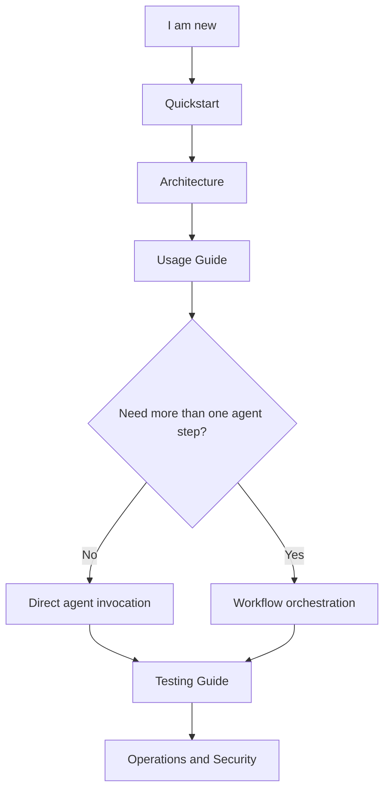
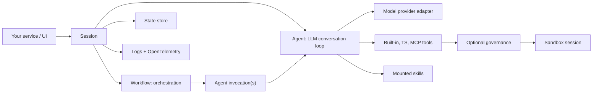

# PURISTA Agent Harness Documentation

`@purista/harness` is a TypeScript runtime for building self-hosted agent
systems. It gives application teams one provider-neutral boundary for sessions,
direct agents, optional workflows, tools, skills, state, sandboxing, logs, and
traces.

The harness is infrastructure, not a hosted SaaS product. You embed it in your
service, choose the adapters, and keep control over data, execution, and
observability.

## Begin With The Right Outcome

| I need to… | Start here | Then continue with |
| --- | --- | --- |
| Understand whether the Harness fits | [Architecture](./concepts/architecture.md) | [Quickstart](./getting-started/quickstart.md) |
| Run my first typed agent | [Quickstart](./getting-started/quickstart.md) | [Configuration](./guides/configuration.md) and [Usage](./guides/usage.md) |
| Give an agent safe capabilities | [Tools and skills](./guides/tools-and-skills.md) | [Security](./security/security-model.md) |
| Coordinate agents or durable work | [Workflows](./guides/workflows.md) | [Durable workspaces](./guides/durable-workspaces.md) |
| Protect content and tool boundaries | [Guardrails](./guides/guardrails.md) | [Security](./security/security-model.md) |
| Prove behavior and operate it | [Testing](./guides/testing.md) | [Evaluations](./guides/evaluating-prompts.md) and [Operations](./operations/runbook.md) |

## Learning Sequence

1. **Foundation** — [Architecture](./concepts/architecture.md), then the
   [Quickstart](./getting-started/quickstart.md).
2. **Build** — [Configuration](./guides/configuration.md),
   [Usage](./guides/usage.md), and [Tools and skills](./guides/tools-and-skills.md).
3. **Compose** — [Workflows](./guides/workflows.md),
   [conversation history](./guides/conversation-history.md), and
   [durable workspaces](./guides/durable-workspaces.md).
4. **Control** — [Guardrails](./guides/guardrails.md) and the
   [security model](./security/security-model.md).
5. **Prove and operate** — [Testing](./guides/testing.md),
   [evaluations](./guides/evaluating-prompts.md), and the
   [operations runbook](./operations/runbook.md).

For PURISTA service integration, use the **AI Agent** card in the framework
handbook. It owns commands, queues, streams, and service contracts; this
documentation owns the standalone Harness runtime.

## First Run

## Documentation Map

- Start building
  - [Quickstart](./getting-started/quickstart.md): install, run the smallest example, and verify the harness works.
  - [Living Wiki Jaeger Example](../examples/living-wiki-jaeger/README.md): explore a full research workspace with agents, workflows, application-owned review tasks, artifacts, MCP, and Jaeger.
  - [Modular Support Harness](../examples/modular-support-harness/README.md): compose typed local modules while retaining application-owned workflows and hermetic replay tests.
  - [Workflow Child Tasks](../examples/workflow-child-tasks/README.md): run bounded fan-out, isolated background tasks, and a short continuable task conversation without credentials.
  - [Agent Plugins](../examples/agent-plugins/README.md): inspect a local package, pin its reviewed digest, and explicitly bind selected Skills or MCP tools.
- Learn the model
  - [Architecture](./concepts/architecture.md): understand sessions, agents, workflows, tools, skills, state, sandboxing, and telemetry.
  - [Common Scenarios And Use Cases](./guides/common-scenarios.md): choose patterns for RAG, triage, application-owned human review, research, reports, and multi-agent work.
- Build applications
  - [Usage Guide](./guides/usage.md): define a harness, open sessions, invoke agents, stream runs, and orchestrate workflows.
  - [Conversation History and Retries](./guides/conversation-history.md): bound stored complete turns and make direct-agent delivery replay-safe.
  - [Workflow Guide](./guides/workflows.md): design fan-out/fan-in, durable steps, streaming, cancellation, and testing for workflow orchestration.
  - [Configuration Guide](./guides/configuration.md): configure models, defaults, sandboxing, timeouts, logging, and OpenTelemetry.
  - [Durable Workspaces](./guides/durable-workspaces.md): configure production replay workspaces, checkpoint references, retention, encryption, cleanup, and quotas.
  - [Evaluating Prompts](./guides/evaluating-prompts.md): compare prompt candidates with local deterministic or custom scorers.
  - [Extending And Customizing](./guides/extending-and-customizing.md): add adapters, TypeScript tools, skills, workflows, and custom state/sandbox implementations.
  - [MCP Tools](./guides/mcp-tools.md): register stdio and HTTP MCP tools, install stdio servers inside the sandbox, and map MCP failures.
  - [Agent Plugins](./guides/agent-plugins.md): inspect trusted Agent Plugins v1 packages and bind selected skills or MCP tools explicitly.
  - [Guardrails](./guides/guardrails.md): configure typed input, output, tool, retrieval, and sensitive-data protection; choose Presidio or native privacy by user outcome.
  - [Migrating To AI Harness 2.0](./guides/migrating-to-v2.md): make the clean MCP v2 and package-major upgrade.
  - [Testing Guide](./guides/testing.md): test agents, workflows, streams, tools, MCP runners, and application-owned review tasks.
- Operate and review
  - [Operations Runbook](./operations/runbook.md): readiness checks, failure handling, logs, traces, MCP operations, and shutdown.
  - [Security Model](./security/security-model.md): trust boundaries, secret handling, sandbox execution, MCP risk, application-owned review tasks, and telemetry privacy.
- Reference
  - [Public API](./reference/public-api.md): package exports, builder shape, session API, run events, errors, and type inference.
  - [Spec Conformance](./reference/spec-conformance.md): current implementation status against the approved specs.

## Repository Map

| Path | Purpose |
|---|---|
| `packages/harness` | Core runtime, builder, sessions, agents, workflows, tools, sandbox, state, telemetry, errors. |
| `packages/harness-openai` | OpenAI model provider adapter. |
| `packages/harness-anthropic` | Anthropic model provider adapter. |
| `packages/harness-bedrock` | Amazon Bedrock model provider adapter. |
| `packages/harness-azure-foundry` | Azure AI Foundry model provider adapter. |
| `packages/harness-agent-plugins` | Opt-in Agent Plugins v1 inspector and explicit Skill/MCP binding addon. |
| `examples/quickstart` | Smallest typed harness example. |
| `examples/showcase` | Skills, TypeScript tools, and multiple workflows. |
| `examples/modular-support-harness` | Static module composition, application workflow ownership, retry-only context projection, and sanitized replay. |
| `examples/workflow-child-tasks` | Bounded fan-out, isolated task ownership and lookup, and in-process continuables. |
| `examples/agent-plugins` | Review, digest-pin, and explicitly bind an installed Agent Plugins package. |
| `examples/bank-governance` | Optional typed governance policies, exposure-aware events, approvals, shadow-ready rollout, and blocked tool calls. |
| `examples/living-wiki-jaeger` | Full local research workspace with SSE, Jaeger, artifacts, application-owned review tasks, Mermaid, draw.io XML, JSON panels, and Three.js graph. |
| `examples/durable-human-review` | Minimal executable review-task pattern: CAS decision, action-digest binding, SQLite restart, idempotent signal, and final side-effect boundary. |
| `specs/` | Approved technical specifications. Use specs for implementation detail, not first-time onboarding. |

## Runtime In One Diagram

The application API is `harness.getSession(...)`, then
`session.agents.<id>` or `session.workflows.<id>`. Providers, tools, sandboxes,
state stores, and durable workspace stores are infrastructure behind that
boundary.

In harness terminology, an **agent** is the typed LLM conversation loop: it
builds prompts, calls a model, executes tool invocations, feeds tool results
back into the model, validates the final output, and emits run events. A
**workflow** is application orchestration: it decides which agents to invoke,
in what order or parallel shape, where application-owned review tasks happen, and when durable
side effects such as wiki writes or report artifacts are allowed.
