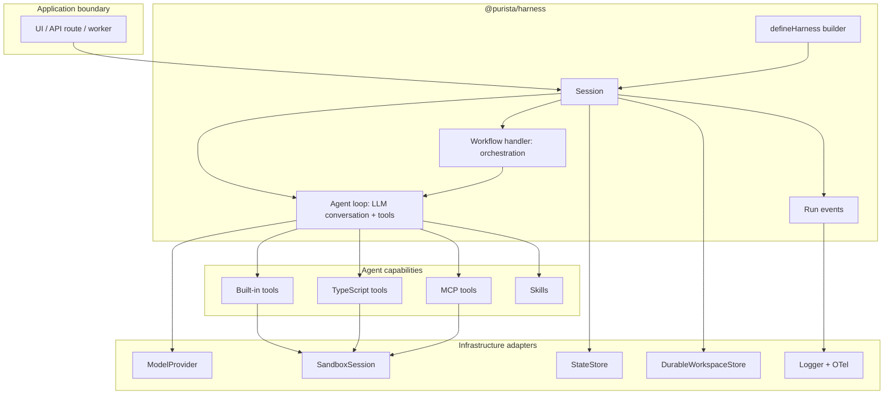
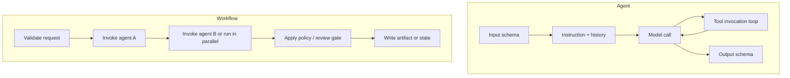
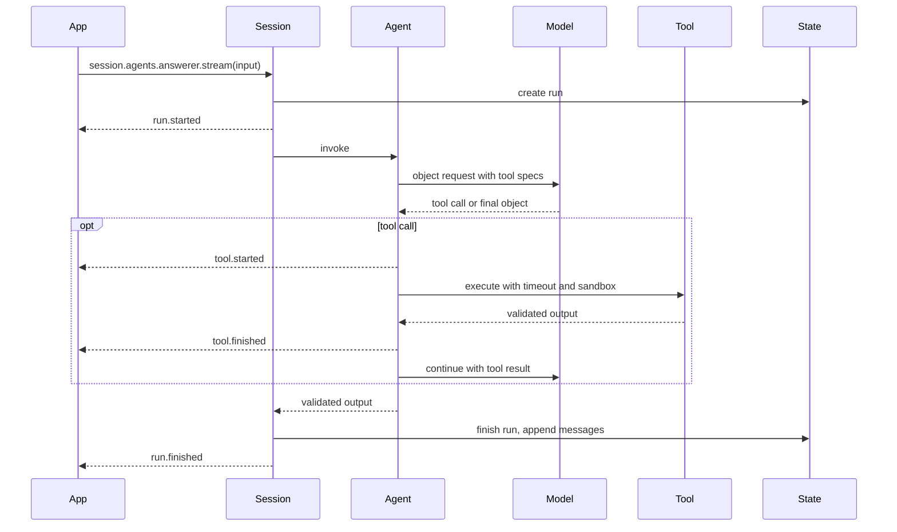
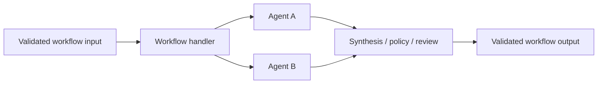
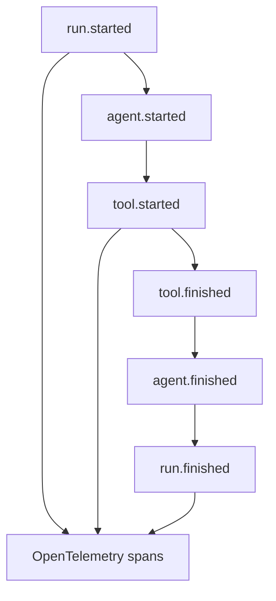

# Architecture

The harness is an in-process TypeScript runtime. It sits between your
application and external model providers, tools, state, sandbox execution, and
telemetry.

## Mental Model

## Core Concepts

| Concept | What It Does | User Decision |
|---|---|---|
| `Harness` | Compiled definition of models, tools, skills, agents, workflows, defaults, and adapters. | What capabilities exist? |
| `Session` | Isolated operational context with memory, history, sandbox, and one active run at a time. | What user/thread/tenant is this run for? |
| `Agent` | A typed LLM conversation loop. It prepares messages, calls the model, executes tool invocations, appends tool results, repeats until the model returns, validates output, and emits events. | What single model-driven job should this loop perform? |
| `Workflow` | Application-owned orchestration around one or more agent invocations. It can sequence, branch, fan out, reflect, judge, request human approval, and perform durable writes. | What business process or multi-step flow must happen around agents? |
| `Tool` | Callable capability exposed to an agent: built-in, TypeScript, or MCP. | What can the agent do besides model calls? |
| `Skill` | Mounted instruction directory with `SKILL.md` frontmatter. | What reusable method or domain guidance should the agent follow? |
| `Sandbox` | Filesystem and optional command execution boundary. | Can this run execute commands, and with what isolation? |
| `DurableWorkspaceStore` | Production replay boundary that links runtime checkpoints to persisted workspace state. | Must this run resume from committed workspace state after retry or restart? |

## Agents Versus Workflows

Use an agent when the unit of work is one LLM conversation loop, even if that
loop uses several tools. Use a workflow when the application needs to control
multiple agent invocations, approval steps, deterministic logic, persistence,
or side effects.

## Direct Agent Lifecycle

## Workflow Lifecycle

Workflows are not required. Use them when the application needs explicit
orchestration around agents.

## Event And Trace Shape

Session streaming APIs emit run events. Applications can render these events in
a chat UI, run inspector, logs, or tests. Model stream chunks consumed inside a
workflow or custom agent handler stay internal unless that model stream call
opts in with `{ emitRunEvents: true }`.

Telemetry emits GenAI and OpenInference attributes by default. Set
`telemetry.flavor` to `gen_ai_only` or `openinference_only` when a backend
expects one namespace. `InvokeOptions.traceparent` and `tracestate` are
extracted before the root run span is created; invalid Trace Context is logged
and the run starts a new trace.

The session, workflow, agent, model, and tool spans form one parent/child trace.
The harness records current GenAI operation-duration metrics for each layer;
failed or aborted operations set `ERROR` and share the same `error.type` on the
span and duration metric, while successful spans retain the OpenTelemetry
default `UNSET` status.

Persisted run events never store prompts, model outputs, tool inputs/results,
memory, files, or user data. They may store operational metadata such as ids,
counts, dimensions, status, serialized errors, and token usage. Telemetry
content capture controls span content only; it does not change StateStore audit
retention.
