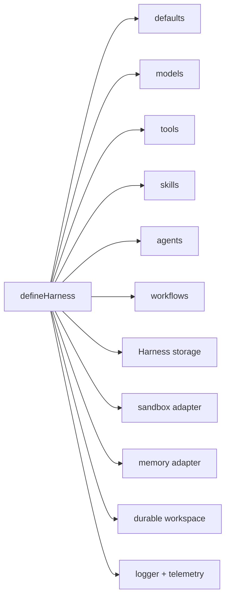

# Configuration Guide

Start with safe defaults, then add explicit adapters when your application
needs durability, command execution, observability, or external tools.

## Minimal Configuration

```ts
const harness = defineHarness({ name: 'my-service' })
	.models({
		fast: {
			provider: openai({ apiKey: process.env.OPENAI_API_KEY! }),
			model: process.env.OPENAI_MODEL ?? 'gpt-5-mini',
			capabilities: ['object'],
		},
	})
	.agent('assistant', {
		model: 'fast',
		instructions: 'Return a concise object.',
	})
	.build()
```

## Configuration Map



| Area | Default | Configure When |
|---|---|---|
| Logger | `JsonLogger` | You need structured logs at a specific level or sink. |
| Storage | `InMemoryHarnessStorage` | Runs/history must survive process restart or workflows need recovery. |
| Sandbox | Auto-detect `bashSandbox()`, fallback to `inMemorySandbox()` | You need predictable execution policy. |
| Memory | Dependency-free process-local engine | Agents need durable, searchable, tenant-scoped, or principal-scoped recall. |
| Durable workspace | None | Runs must pause, resume, retry, or recover with workspace state intact. |
| Context checkpoints | None | Long-horizon workflows need explicit durable summaries or handoff records. |
| Models | Required | Every agent needs a model alias. |
| Tools | Optional | Agents need retrieval, writes, MCP, or application APIs. |
| Skills | Optional | Agents need reusable instructions or report methods. |
| Workflows | Optional | You need orchestration beyond one agent turn. |

## Models

```ts
.models({
  fast: {
    provider: openai({
      apiKey: process.env.OPENAI_API_KEY!,
      baseURL: process.env.OPENAI_BASE_URL,
      organization: process.env.OPENAI_ORG,
      project: process.env.OPENAI_PROJECT,
      api: 'responses'
    }),
    model: process.env.OPENAI_MODEL ?? 'gpt-5-mini',
    capabilities: ['object', 'tool_use'],
    defaults: { maxTokens: 1200 },
    retry: true
  }
})
```

Provider packages are independent addons. Install only the SDK surface your
application needs:

```ts
import { openai } from '@purista/harness-openai'
import { google } from '@purista/harness-google'
import { anthropic } from '@purista/harness-anthropic'
import { bedrock } from '@purista/harness-bedrock'
import { azureFoundry } from '@purista/harness-azure-foundry'

.models({
  openai: {
    provider: openai({ apiKey: process.env.OPENAI_API_KEY! }),
    model: process.env.OPENAI_MODEL ?? 'gpt-5-mini',
    capabilities: ['object', 'tool_use']
  },
  gemini: {
    provider: google({ apiKey: process.env.GEMINI_API_KEY! }),
    model: process.env.GEMINI_MODEL ?? 'gemini-2.5-flash',
    capabilities: ['object', 'tool_use', 'vision_input']
  },
  claude: {
    provider: anthropic({ apiKey: process.env.ANTHROPIC_API_KEY! }),
    model: process.env.ANTHROPIC_MODEL ?? 'claude-sonnet-4-5',
    capabilities: ['object', 'tool_use']
  },
  bedrock: {
    provider: bedrock({ region: process.env.AWS_REGION ?? 'us-east-1' }),
    model: process.env.BEDROCK_MODEL ?? 'anthropic.claude-3-5-sonnet-20241022-v2:0',
    capabilities: ['object', 'tool_use']
  },
  azure: {
    provider: azureFoundry({
      endpoint: process.env.AZURE_AI_ENDPOINT!,
      apiKey: process.env.AZURE_AI_API_KEY!
    }),
    model: process.env.AZURE_AI_MODEL ?? 'gpt-4.1-mini',
    capabilities: ['object', 'tool_use', 'embeddings']
  }
})
```

`@purista/harness-openai` defaults to Chat Completions for OpenAI-compatible
endpoints. Configure a compatible endpoint with its own key and `baseURL`; the
target must implement the Chat Completions operations you enable. Set
`api: 'responses'` only for OpenAI reasoning models that require the OpenAI
Responses API when using function tools with `providerOptions.reasoning_effort`
for models such as `gpt-5.5`; it is not a generic compatible-endpoint mode. On
the Chat Completions path, the adapter drops `reasoning_effort` when tools are
present and emits a warning instead of letting the provider reject the request.
On the Responses API, tool-call
responses carry a typed `providerContinuation` template. The adapter retains
opaque reasoning items and reconstructs tool-call slots from the current
canonical tool calls, so transformed arguments replace the original wire
arguments. Opaque reasoning is not content a rail can inspect or rewrite.

### Generation settings are model and API specific

Use the typed alias/default or per-call fields for common settings:
`maxTokens`, `temperature`, `topP`, `stopSequences`, and
`parallelToolCalls`. A per-call value wins over the alias default. They are
mapped by each provider adapter, but the chosen model and endpoint decide
whether the field is accepted.

| Setting | Important provider difference |
|---|---|
| `maxTokens` | OpenAI Chat defaults to `max_tokens` (opt into `max_completion_tokens` with `openai({ chatCompletionMaxTokensParameter: 'max_completion_tokens' })`); OpenAI Responses uses `max_output_tokens`; Gemini, Anthropic, Bedrock, and Azure use their native output-limit fields. Anthropic falls back to 1024 if omitted. |
| `temperature` / `topP` | Do not tune both by default. Current reasoning and Claude models can reject sampling controls; omit them unless the selected model documents support. |
| `stopSequences` | OpenAI Responses does not support them and the adapter rejects the configuration rather than dropping it. Other first-party endpoint shapes map a native stop field subject to model limits. |
| `parallelToolCalls` | It is a provider tool-selection preference, not Harness execution concurrency. Bedrock Converse has no mapping; use Harness `maxParallelToolCalls` to bound actual tool execution. |

Use `providerOptions` only for a field documented by that provider/API/model.
It merges shallowly from alias options, defaults, then per-call options. Do not
repeat typed settings there because raw-field precedence is adapter-specific.
OpenAI, Anthropic, Bedrock, and Azure reserve `requestOptions` for SDK
transport options; Gemini nests its SDK-only generation fields under
`providerOptions.config`; Bedrock uses `additionalModelRequestFields`; Azure
pass-through parameters require the documented `extra-parameters: pass-through`
header.

`@purista/harness-google` uses Google's official Gemini API SDK. It supports
text, structured output, tools, streams, embeddings, and the supported inline
multimodal parts; it does not expose rerank. Google API and model support vary,
so declare only capabilities verified for the selected model and endpoint.

Capabilities gate runtime calls:

| Capability | Enables |
|---|---|
| `text` | Plain text generation. |
| `text_stream` | Plain text streaming. |
| `object` | Structured object generation validated against the requested schema. |
| `object_stream` | Structured object streaming as typed provider chunks; run events are opt-in per stream call. |
| `tool_use` | Model tool calling. |
| `vision_input` | Image input understanding where adapter supports it. |
| `audio_input` | Audio input understanding where adapter supports it. |
| `file_input` | File input understanding where adapter supports it. |
| `embeddings` | Embedding vector generation for retrieval workflows. |
| `rerank` | Document reranking for retrieval workflows. |

## Model Retry And Outcomes

Model retry is enabled by default. The harness retries short transient provider
failures and rate limits with bounded backoff, but it does not sleep for long
provider `Retry-After` windows. `longRetry` decides what happens instead:
`'error'` (the default) fails immediately with `retryKind: 'none'`, while
`'defer'` returns a typed `ModelError` with `retryKind: 'deferred'` and the
provider-supplied `retryAfterMs` so an API can fail fast and a worker/queue can
schedule a later retry. With `'defer'`, `maxDeferredDelayMs` caps how long a
provider wait may be before it degrades to `retryKind: 'none'`. If active
retries were attempted and then exhausted, the final error reports
`retryKind: 'active'` with attempt metadata.

```ts
.models({
  assistant: {
    provider: openai({ apiKey: process.env.OPENAI_API_KEY! }),
    model: process.env.OPENAI_MODEL ?? 'gpt-5-mini',
    capabilities: ['object', 'tool_use'],
    retry: {
      maxAttempts: 3,
      maxActiveElapsedMs: 60_000,
      maxActiveDelayMs: 20_000,
      respectRetryAfter: true,
      longRetry: 'error'
    }
  }
})
```

Use `retry: false` for tests, strict request/response APIs, or provider calls
where any automatic retry is undesirable. Per-call `call.retry` overrides the
alias policy. Retry policies are validated at runtime for JavaScript and
generated config users: invalid attempt counts, negative budgets, unknown
`longRetry` values, or non-boolean `retryOn` entries fail with
`HarnessConfigError` before a provider call starts.

Model responses keep a simple `finishReason` and may include `outcome` with the
raw provider finish/status reason. Use `finishReason` for normal application
flow and `outcome` for operations or provider-specific handling.

## Defaults

```ts
.defaults({
  runTimeoutMs: 600_000,
  modelTimeoutMs: 300_000,
  toolTimeoutMs: 120_000,
  skillTimeoutMs: 60_000,
  agentMaxIterations: 16,
  maxParallelToolCalls: 8,
  historyWindow: 20,
  delegation: {
    enabled: false,
    maxChildAgentCalls: 32,
    maxParallelChildAgentCalls: 8,
    maxDepth: 1
  }
})
```

Use smaller budgets for user-facing request/response paths and larger budgets
for background research workflows.

`defaults.decisionTimeoutMs` defaults to `10_000` and must be a positive safe
integer. Policy, approval, exposure, and interceptor callbacks receive a
bounded signal and deadline. The earliest remaining decision, run, or tool
deadline wins. `toolTimeoutMs` covers preparation, execution queueing, policy,
approval, handler, and output hooks; approval does not restart the clock.
See [decisions and approval](./decisions-and-approval.md) for cancellation,
fail-closed errors, and the separate durable-review boundary.

`agentMaxIterations` and an agent's `maxSteps` must be positive integers. An
explicit value is honored as configured rather than silently capped; pair large
budgets with appropriate run and model timeouts.

`BaseModelProvider` races each model operation (and each pending stream chunk)
against its effective signal. A model timeout or caller cancellation is
therefore terminal even when a provider SDK does not promptly observe abort;
the SDK work itself can continue in the background until it cooperates.

`defaults.delegation` controls workflow-local child-agent calls through
`ctx.agents`. Delegation is disabled by default. Prefer enabling it per
workflow with `workflow.delegation`; use `defaults.delegation.enabled: true`
only when every workflow in the harness should be allowed to call child agents.

Delegation settings:

- `enabled`: global switch for workflows without their own policy. Default:
  `false`. A workflow-level `delegation` object enables that workflow unless it
  sets `enabled: false`.
- `maxChildAgentCalls`: total child-agent calls one workflow run may start.
  Default after opt-in: `32`.
- `maxParallelChildAgentCalls`: child-agent calls active at the same time.
  Default after opt-in: `8`.
- `maxDepth`: local delegation depth. Default after opt-in: `1`, which allows
  workflow-to-agent calls. `0` disables child-agent calls.

## Skills

Skills are reusable instructions mounted into the sandbox. The harness prompt
contains only the skill name, description, compatibility, and
`/skills/<name>/SKILL.md` location. The full skill body is mounted only when an
agent declares the skill and must be loaded with the `read` built-in.

```ts title="Register an agent skill"
.skills({
  'incident-responder': {
    directory: './src/skills/incident-responder',
    trust: 'trusted',
    source: 'application',
  },
})
  .agent('triage', {
    model: 'fast',
    skills: ['incident-responder'],
    builtinTools: ['read'],
    instructions: 'Use relevant skills before producing the final object.',
  })
```

`SKILL.md` must start with YAML frontmatter containing `name` and
`description`. Optional fields such as `compatibility`, `license`, `metadata`,
and `allowed-tools` are preserved for catalog and policy use. Strict parsing is
the default for explicit bindings. Discovery uses lenient parsing so agent
clients can repair common scalar quoting issues without exposing invalid skill
bodies.

Use explicit `.skills(...)` bindings for production. `discoverSkills(...)` is
available for client-style local projects; project skill roots are ignored until
the project root is explicitly trusted. Higher-precedence bindings win and
shadowed collisions are returned as diagnostics.

## Sandbox

```ts
import { bashSandbox, inMemorySandbox } from '@purista/harness'

.sandbox(inMemorySandbox()) // files + bounded text search; no command execution
.sandbox(bashSandbox())     // same search contract + just-bash execution
```

Register the sandbox before `.tools(...)` to infer `ctx.sandbox` from its
declared capabilities. Files-only sessions have no typed `exec` or `spawn`;
adapters declaring both expose both. Auto-detected or dynamically widened
adapters expose only base filesystem operations until narrowed with
`isExecCapableSession` or `isSpawnCapableSession`.

Bash networking and Python are disabled by default. Optional
`network.allow` entries are reviewed URL prefixes. Use
`executionLimits.wallClockMs` for command duration and
`executionLimits.maxFileSystemBytes` for retained emulator filesystem bytes;
the latter is not a host-memory quota. Invalid or unknown options fail early.
Bash inherits `toolTimeoutMs` from Harness, using 120 seconds when called
independently.

For an optional local Docker adapter, see its
[configuration and engine requirements](../../packages/harness-sandbox-docker/README.md)
and the [standalone lifecycle example](../../examples/local-docker-sandbox/README.md).
The example uses only the public sandbox packages, without a model or PURISTA
framework dependency.

For self-hosted production execution and optional durable files, use the
[Kubernetes adapter](../../packages/harness-sandbox-kubernetes/README.md).
It returns `{ sandbox, workspace?, close }`; enable `workspace` only when the
workflow needs PVC/VolumeSnapshot recovery. Pair it with
[`@purista/harness-storage-postgres`](../../packages/harness-storage-postgres/README.md)
for distributed sessions, leases, checkpoints, and waits. Replicas of one
runtime share a stable `runtimeId`; independent runtimes use distinct IDs.

## Local Durable Bundle

Use `localDurableExecution` when you want durable conversations, checkpointed
workflows, waits, and workspace restore without Docker or an external
database:

```ts
import { localDurableExecution } from '@purista/harness'

const local = localDurableExecution({ root: '.purista/harness', exec: false })

const harness = defineHarness()
	.storage(local.storage)
	.sandbox(local.sandbox)
	.workspace(local.workspace)
	.requires(['storage.persistent', 'workspace.persistent'])
	.models(models)
	.agents(agents)
	.workflows(workflows)
	.build()
```

Host exec is disabled by default. Keep it disabled for untrusted model/tool
paths, or move to the Kubernetes adapter or another reviewed isolating runtime
when you need stronger isolation.

Choose `inMemorySandbox()` when agents need files and search but no command
execution. Built-in `grep` does not require `exec`; it requires
`sandbox.text_search`, which both built-in sandboxes provide. Choose an
executor-capable sandbox for built-in `bash`, and a spawn-capable adapter for
`mcp_stdio`.

This keeps the adoption path small:

1. Omit `.sandbox(...)` or select `inMemorySandbox()` for local development and
   single-process deployments.
2. Select `bashSandbox()` only for reviewed, trusted in-process commands.
3. Swap in Docker, Kubernetes, a microVM, or a remote provider adapter when
   isolation, shared persistence, resource limits, or data locality requires
   it. Agent definitions and their `grep` calls do not change.

An agent that enables `grep` adds `sandbox.text_search` to the Harness's
effective requirements. A custom adapter without that capability fails at
`.build()` before model or sandbox I/O; Harness never falls back to reading
remote files into core or executing an undeclared shell command.

Sandbox snapshot/resume/hibernate is a low-level sandbox adapter capability.
Production durable replay uses one shared storage adapter and, for files, a
durable workspace:

```ts
.storage(harnessStorage)
.workspace(durableWorkspace)
.requires([
  'storage.workspace_checkpoint',
  'workspace.durable',
  'workspace.checkpoint',
  'workspace.resume',
  'workspace.cleanup'
])
```

Use [Durable Workspaces](./durable-workspaces.md) when runs must survive process
restart, retry from a committed checkpoint, enforce retention, encrypt stored
workspace state, clean up terminal workspaces, or enforce quotas.

## Memory

No `.memory(...)` call is required for deterministic tests, development, or a
single process. Configure one dedicated engine when memory must survive a
restart, be shared, or provide recall:

```ts
import { sqliteMemoryEngine } from '@purista/harness-memory-sqlite'

.memory(sqliteMemoryEngine({ file: '.purista/memory.sqlite' }))
```

Use PostgreSQL/pgvector, Redis Search, or NATS JetStream packages for their
matching deployment boundary. SQLite vectors are an explicit
`sqlite-vec@0.1.9` opt-in; NATS intentionally has no search capability.

Bind optional tenant/principal identity when opening the session:

```ts
const session = await harness.getSession('claim:42', {
	tenantId: account.tenantId,
	principalId: account.id,
})
```

The containing workflow still needs to opt into child-agent calls, for example
with `delegation: { agents: ['answerer'] }`.

Inside workflows, agents, and TypeScript tools, use
`ctx.memory.application`, `ctx.memory.tenant()`, `ctx.memory.principal()`,
`ctx.memory.session`, `ctx.memory.run`, and `ctx.memory.agent`. Tenant and
principal helpers fail before engine I/O when that identity dimension is absent.

## Telemetry And Logs

```ts
.logger(new JsonLogger({ level: process.env.PURISTA_HARNESS_LOG_LEVEL ?? 'info' }))
.telemetry({ contentCaptureMode: 'NO_CONTENT' })
```

`contentCaptureMode` defaults to `NO_CONTENT`. v1 core accepts the full enum but
does not emit prompt, model output, tool input/result, file, expected-output, or
context content in any mode. Memory content is omitted by default and follows
the bounded memory-facade capture policy when non-`NO_CONTENT` modes are enabled.

Model token usage is attached to model spans using both GenAI and OpenInference
attributes. Optional cache-read, cache-creation, and reasoning token details are
included when provider adapters report them. The harness also emits metrics
through the configured OpenTelemetry meter so aggregate usage and durations
remain available even when a production trace backend samples or drops spans.
Each evaluated governance execution policy emits a content-free
`harness.policy.evaluate` guardrail span for both native and external policies,
alongside policy evaluation, denial, and approval-request metrics. These records
carry stable policy and operation identifiers, never policy input, tool payloads,
approval comments, or credentials.

Application code can add its own metrics from workflow, custom-agent, and
TypeScript-tool handlers:

```ts
handler: async ctx => {
	ctx.metrics.counter('app.requests', 1, { route: 'support' })
	return ctx.metrics.duration('app.workflow.duration', undefined, async () => {
		return ctx.agents.answerer(ctx.input)
	})
}
```

Declare `delegation: { agents: ['answerer'] }` on workflows that call
`ctx.agents`.

Run cancellation uses `InvokeOptions.signal`; per-call `timeoutMs` overrides
`defaults.runTimeoutMs`. The harness passes the active signal into workflows,
custom agents, model calls, tools, memory, and sandbox operations. Workflow and
custom-agent handlers are also raced against the signal so a hung handler does
not keep the run open forever. Application code should still stop work when
`ctx.signal.aborted` or `ctx.signal.throwIfAborted()` indicates cancellation.

Cancelled runs are logged at `warn`; timeout and other failures are logged at
`error`. Logs and spans use the normalized harness error shape. Trace error
attributes include `harness.error.code`, `harness.error.category`,
`harness.error.retriable`, and, for timeout/cancel paths,
`harness.error.scope` plus `harness.error.timeout_ms` when available.

## Environment Variables Used By Examples

| Variable | Purpose |
|---|---|
| `OPENAI_API_KEY` | Enables live OpenAI calls. |
| `OPENAI_MODEL` | Model name used by examples, default `gpt-5-mini`. |
| `OPENAI_BASE_URL` | Optional OpenAI-compatible endpoint. |
| `OPENAI_ORG` / `OPENAI_PROJECT` | Optional OpenAI account routing. |
| `ANTHROPIC_API_KEY` / `ANTHROPIC_MODEL` | Optional Anthropic provider configuration. |
| `GEMINI_API_KEY` / `GEMINI_MODEL` / `GEMINI_EMBEDDING_MODEL` | Optional Google Gemini API configuration. |
| `AWS_REGION` / `BEDROCK_MODEL` | Optional Amazon Bedrock provider configuration. |
| `AZURE_AI_ENDPOINT` / `AZURE_AI_API_KEY` / `AZURE_AI_MODEL` | Optional Azure AI Foundry provider configuration. |
| `PURISTA_HARNESS_LOG_LEVEL` | Logger level for `JsonLogger`. |
| `OTEL_EXPORTER_OTLP_ENDPOINT` | OTLP/HTTP endpoint for traces, default example value `http://localhost:4318`. |

## Production Checklist

- Use durable `HarnessStorage` for long-lived sessions and audit history.
- Define tenant-safe session IDs.
- Set explicit timeout budgets.
- Wire caller cancellation through `InvokeOptions.signal`.
- Keep content capture disabled unless approved.
- Use permission gates for mutating built-in tools.
- Use executor-capable sandbox only where command execution is required.
- Use durable workspace stores for production replay; sandbox snapshots alone
  are not a production replay guarantee.
- Test provider failures, validation failures, cancellation, and shutdown.
