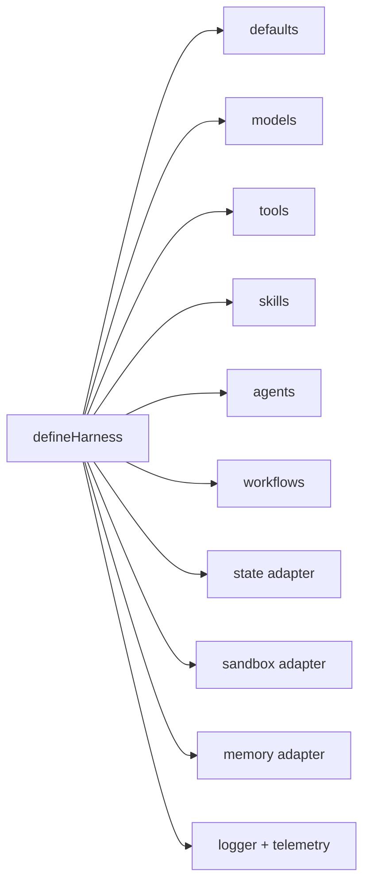

# Configuration Guide

Start with safe defaults, then add explicit adapters when your application
needs durability, command execution, observability, or external tools.

## Minimal Configuration

```ts
const harness = defineHarness({ name: 'my-service' })
  .models({
    fast: {
      provider: openai({ apiKey: process.env.OPENAI_API_KEY! }),
      model: process.env.OPENAI_MODEL ?? 'gpt-5-mini',
      capabilities: ['object']
    }
  })
  .agents(({ agent }) => ({
    assistant: agent({
      model: 'fast',
      builtinTools: false,
      instructions: 'Return a concise object.'
    })
  }))
  .build()
```

## Configuration Map



| Area | Default | Configure When |
|---|---|---|
| Logger | `JsonLogger` | You need structured logs at a specific level or sink. |
| State | In-memory state | Runs/history must survive process restart. |
| Sandbox | Auto-detect `bashSandbox()`, fallback to `inMemorySandbox()` | You need predictable execution policy. |
| Memory | `sandboxMemory()` | Agents need persistent, searchable, user-scoped, or tenant-scoped memory. |
| Models | Required | Every agent needs a model alias. |
| Tools | Optional | Agents need retrieval, writes, MCP, or application APIs. |
| Skills | Optional | Agents need reusable instructions or report methods. |
| Workflows | Optional | You need orchestration beyond one agent turn. |

## Models

```ts
.models({
  fast: {
    provider: openai({
      apiKey: process.env.OPENAI_API_KEY!,
      baseURL: process.env.OPENAI_BASE_URL,
      organization: process.env.OPENAI_ORG,
      project: process.env.OPENAI_PROJECT
    }),
    model: process.env.OPENAI_MODEL ?? 'gpt-5-mini',
    capabilities: ['object', 'tool_use'],
    defaults: { maxTokens: 1200 }
  }
})
```

Provider packages are independent addons. Install only the SDK surface your
application needs:

```ts
import { openai } from '@purista/harness-openai'
import { anthropic } from '@purista/harness-anthropic'
import { bedrock } from '@purista/harness-bedrock'
import { azureFoundry } from '@purista/harness-azure-foundry'

.models({
  openai: {
    provider: openai({ apiKey: process.env.OPENAI_API_KEY! }),
    model: process.env.OPENAI_MODEL ?? 'gpt-5-mini',
    capabilities: ['object', 'tool_use']
  },
  claude: {
    provider: anthropic({ apiKey: process.env.ANTHROPIC_API_KEY! }),
    model: process.env.ANTHROPIC_MODEL ?? 'claude-sonnet-4-5',
    capabilities: ['object', 'tool_use']
  },
  bedrock: {
    provider: bedrock({ region: process.env.AWS_REGION ?? 'us-east-1' }),
    model: process.env.BEDROCK_MODEL ?? 'anthropic.claude-3-5-sonnet-20241022-v2:0',
    capabilities: ['object', 'tool_use']
  },
  azure: {
    provider: azureFoundry({
      endpoint: process.env.AZURE_AI_ENDPOINT!,
      apiKey: process.env.AZURE_AI_API_KEY!
    }),
    model: process.env.AZURE_AI_MODEL ?? 'gpt-4.1-mini',
    capabilities: ['object', 'tool_use', 'embeddings']
  }
})
```

Capabilities gate runtime calls:

| Capability | Enables |
|---|---|
| `text` | Plain text generation. |
| `text_stream` | Plain text streaming. |
| `object` | Structured object generation validated against the requested schema. |
| `object_stream` | Structured object streaming as typed provider chunks and harness run events. |
| `tool_use` | Model tool calling. |
| `vision_input` | Image input understanding where adapter supports it. |
| `audio_input` | Audio input understanding where adapter supports it. |
| `file_input` | File input understanding where adapter supports it. |
| `embeddings` | Embedding vector generation for retrieval workflows. |
| `rerank` | Document reranking for retrieval workflows. |

## Defaults

```ts
.defaults({
  runTimeoutMs: 600_000,
  modelTimeoutMs: 300_000,
  toolTimeoutMs: 120_000,
  skillTimeoutMs: 60_000,
  agentMaxIterations: 16,
  historyWindow: 20
})
```

Use smaller budgets for user-facing request/response paths and larger budgets
for background research workflows.

## Sandbox

```ts
import { bashSandbox, inMemorySandbox } from '@purista/harness'

.sandbox(inMemorySandbox()) // file-only, no command execution
.sandbox(bashSandbox())     // command execution through just-bash
```

Choose `inMemorySandbox()` when agents do not need command execution. Choose an
executor-capable sandbox for built-in `bash`, exec-backed `grep`, and
`mcp_stdio`.

## Memory

```ts
import { sandboxMemory } from '@purista/harness'

.memory(sandboxMemory())
```

`sandboxMemory()` is the default when `.memory(...)` is omitted. It stores
session memory in `/memory/session/<key>.json` and run memory in
`/memory/runs/<runId>/<key>.json` inside the session sandbox. Use a dedicated
memory adapter package when the application needs persistence outside the
sandbox, semantic search, user or tenant scopes, TTL handling, or shared memory
across sessions.

```ts
const result = await ctx.agents.answerer(ctx.input, {
  metadata: { userId: account.id, tenantId: account.tenantId }
})
```

Inside workflows, agents, and TypeScript tools, use `ctx.memory.session`,
`ctx.memory.run`, `ctx.memory.agent`, `ctx.memory.user()`, and
`ctx.memory.tenant()`. The `user()` and `tenant()` helpers use sanitized
`metadata.userId` and `metadata.tenantId` when no explicit id is passed.

## Telemetry And Logs

```ts
.logger(new JsonLogger({ level: process.env.PURISTA_HARNESS_LOG_LEVEL ?? 'info' }))
.telemetry({ contentCaptureMode: 'NO_CONTENT' })
```

`contentCaptureMode` defaults to `NO_CONTENT`. v1 core accepts the full enum but
does not emit prompt, model output, tool input/result, file, expected-output, or
context content in any mode. Memory content is omitted by default and follows
the bounded memory-facade capture policy when non-`NO_CONTENT` modes are enabled.

Model token usage is attached to model spans using both GenAI and OpenInference
attributes. The harness also emits metrics through the configured OpenTelemetry
meter so aggregate usage and durations remain available even when a production
trace backend samples or drops spans.

Application code can add its own metrics from workflow, custom-agent, and
TypeScript-tool handlers:

```ts
handler: async (ctx) => {
  ctx.metrics.counter('app.requests', 1, { route: 'support' })
  return ctx.metrics.duration('app.workflow.duration', undefined, async () => {
    return ctx.agents.answerer(ctx.input)
  })
}
```

## Environment Variables Used By Examples

| Variable | Purpose |
|---|---|
| `OPENAI_API_KEY` | Enables live OpenAI calls. |
| `OPENAI_MODEL` | Model name used by examples, default `gpt-5-mini`. |
| `OPENAI_BASE_URL` | Optional OpenAI-compatible endpoint. |
| `OPENAI_ORG` / `OPENAI_PROJECT` | Optional OpenAI account routing. |
| `ANTHROPIC_API_KEY` / `ANTHROPIC_MODEL` | Optional Anthropic provider configuration. |
| `AWS_REGION` / `BEDROCK_MODEL` | Optional Amazon Bedrock provider configuration. |
| `AZURE_AI_ENDPOINT` / `AZURE_AI_API_KEY` / `AZURE_AI_MODEL` | Optional Azure AI Foundry provider configuration. |
| `PURISTA_HARNESS_LOG_LEVEL` | Logger level for `JsonLogger`. |
| `OTEL_EXPORTER_OTLP_ENDPOINT` | OTLP/HTTP endpoint for traces, default example value `http://localhost:4318`. |

## Production Checklist

- Use durable `StateStore` for long-lived sessions and audit history.
- Define tenant-safe session IDs.
- Set explicit timeout budgets.
- Keep content capture disabled unless approved.
- Use permission gates for mutating built-in tools.
- Use executor-capable sandbox only where command execution is required.
- Test provider failures, validation failures, cancellation, and shutdown.
