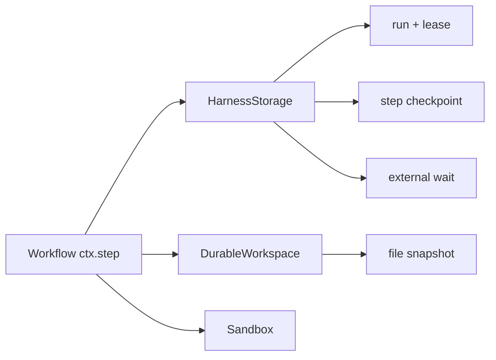

# Recoverable Workflows And Durable Workspaces

Harness 3 has one persistence contract: `HarnessStorage`. It stores sessions,
messages, run records, events, workflow step checkpoints, leases, and opaque
external waits. `DurableWorkspace` is separate because file snapshots have a
different lifecycle. `Sandbox` remains the execution boundary.



## Local Node.js And Bun Setup

`localDurableExecution` uses the runtime's built-in SQLite module and adds no
database dependency. It is intended for development, tests, and one process on
one host.

```ts
import { defineHarness, localDurableExecution } from '@purista/harness'

const local = localDurableExecution({
  root: './.harness',
  exec: false,
  policy: { retention: { cleanupMode: 'manual_only' } }
})

const harness = defineHarness({ name: 'report-worker' })
  .storage(local.storage)
  .workspace(local.workspace)
  .sandbox(local.sandbox)
  .requires([
    'storage.persistent',
    'storage.checkpoint',
    'storage.resume',
    'workspace.persistent'
  ])
  .build()
```

Close the Harness during graceful shutdown. It closes configured adapters;
`local.close()` is available when the bundle is used outside a Harness.

## Create Replay Boundaries

Only workflows support recoverable execution. Invoke one with a stable logical
run ID and put replayable work behind stable step IDs:

```ts
const result = await session.workflows.report.prompt(input, {
  durable: { runId: `report:${input.reportId}:v1` }
})

// Inside the workflow:
const facts = await ctx.step('collect-facts-v1', () => collectFacts(ctx.input))
const draft = await ctx.step('draft-v1', () => ctx.agents.writer(facts))
```

On retry, a committed step returns its stored JSON output without running the
callback again. Version a step ID when its output contract or side effects
change. Keep external writes idempotent: a crash can happen after an external
system commits but before Harness commits the next checkpoint.

## Status And Recovery

| Status | Meaning | Can acquire again? |
| --- | --- | --- |
| `running` | A worker owns or was executing the run. | Yes, subject to lease rules. |
| `waiting` | An external wait was registered and the lease released. | Yes, after a terminal signal. |
| `interrupted` | Execution stopped without a terminal result. | Yes. |
| `succeeded` | Final output committed. | No. |
| `failed` | Terminal failure committed. | No. |
| `cancelled` | Cancellation committed. | No. |

The storage must serialize each session, enforce one active lease per run and
session, commit checkpoints atomically, and register a wait together with the
`waiting` transition and lease release.

## Production Adapter

For multiple processes or hosts, implement `HarnessStorage` against one shared
database with transactional lease and wait semantics. Do not wrap a generic KV
store. Run the public contract suite and add backend-specific contention,
migration, retention, deletion, and outage tests:

```ts
import { harnessStorageContract, durableWorkspaceContract } from '@purista/harness/testing'

harnessStorageContract(() => createPostgresHarnessStorage(testDatabase))
durableWorkspaceContract(() => createObjectStorageWorkspace(testBucket))
```

OpenTelemetry operations use `harness.storage.*` and `harness.workspace.*`.
Attributes are content-free: record adapter, operation, run/session correlation,
attempt, sequence, wait kind/outcome, duration, and normalized errors—never
prompt text, checkpoint output, files, wait IDs, credentials, or tool data.

## SQLite Compatibility

Harness 3 intentionally rejects Harness 2 SQLite schemas, including
`harness_durable_runs` and `harness_context_checkpoints`. Create a new database
and migrate only application-approved conversation data through an explicit
export/import process. See [Migrating To Harness 3](./migrating-to-v3.md).
