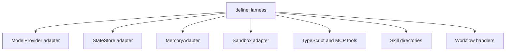

# Extending And Customizing

Extend the harness by adding adapters, tools, skills, and workflows behind the
same session API.

## Extension Points



## Add A Model Provider Adapter

Implement `ModelProvider` or extend `BaseModelProvider`.

Adapter responsibilities:

- translate harness requests to the provider SDK;
- map text, structured object, multimodal content, tool calls, embeddings,
  rerank results, token usage, and finish reasons;
- pass through provider SDK options where possible;
- let `BaseModelProvider` handle timeout, cancellation, logging, tracing, and
  normalized errors.

Provider adapters should expose `object(...)` and `objectStream(...)` for
schema-validated structured output. Expose `embed(...)` and `rerank(...)` only
when the provider SDK can support those operations cleanly; otherwise omit the
method and do not declare the matching capability.

## Add A State Store Adapter

Implement `StateStore` when sessions, runs, messages, and events must outlive
the process.

Durable adapters should pass the shared state-store contract tests.

## Add A Memory Adapter

Implement `MemoryAdapter` when agent memory must live outside the default
sandbox-backed `sandboxMemory()` adapter.

Adapter responsibilities:

- declare exact `memory.*` capabilities, including scopes and optional search,
  TTL, and persistence;
- implement backend I/O only; core owns standard validation, telemetry, metrics,
  content-capture policy, and error wrapping;
- respect `ctx.signal` on every backend call;
- use `ctx.telemetry` and `ctx.metrics` only for backend-specific nested spans
  or metrics;
- keep Redis, Postgres, vector, graph, or product-specific adapters in separate
  `@purista/harness-memory-*` packages.

Memory adapters should pass `memoryAdapterContract` from
`@purista/harness/testing`.

## Add A Sandbox Adapter

Implement `Sandbox` and `SandboxSession` when you need stronger isolation,
containers, remote execution, or custom filesystem policy.

Sandbox sessions must make executor availability explicit:

- `executor: 'unavailable'` for file-only sessions;
- `executor: 'available'` when `exec(...)` is supported.

Snapshot-capable adapters may also implement `snapshot(...)`, `resume(...)`,
and `hibernate(...)`. Declare the matching adapter capabilities so applications
can fail early when they require durable sandbox behavior:

```ts
defineHarness()
  .sandbox(snapshotCapableSandbox)
  .requires(['sandbox.snapshot', 'sandbox.resume'])
```

Preview ports and browser routing remain application concerns, not core
sandbox capabilities.

## Add A Durable Runtime Adapter

Durable execution is opt-in. A runtime adapter declares capabilities and owns
checkpoint storage, leases, retries, and resume behavior.

```ts
const harness = defineHarness()
  .runtime(inMemoryDurableRuntime())
  .requires(['runtime.checkpoint', 'runtime.resume_from_checkpoint'])
  .models(...)
  .agents(...)
  .build()
```

Streams remain observation only. Recovery starts from the last committed
checkpoint, not from a stream cursor.

## Attach Feedback

Feedback is optional and app-defined. Core exports shared target/record types;
applications or addon packages own storage and learning workflows.

```ts
feedback.record({
  target: { kind: 'run', runId },
  source: 'user',
  label: 'useful'
})
```

## Add TypeScript Tools

```ts
.tools({
  policy_lookup: {
    description: 'Look up a short policy by topic.',
    input: z.object({ topic: z.string() }),
    output: z.object({ text: z.string() }),
    handler: async (ctx, input) => {
      ctx.logger.info('Looking up policy.', { tool_id: ctx.toolId })
      return { text: `Policy for ${input.topic}` }
    }
  }
})
```

Rules:

- validate input and output with schemas;
- return JSON-compatible data;
- respect `ctx.signal`;
- use `ctx.sandbox` for sandboxed file/exec operations;
- avoid leaking secrets in logs.

## Add MCP Tools

Use [MCP Tools](./mcp-tools.md) for exact stdio/HTTP setup. Summary:

- `mcp_stdio` runs through the sandbox executor and supports `install`;
- `mcp_http` calls a remote MCP endpoint;
- both validate schemas and normalize outputs.

## Add Skills

A skill directory contains `SKILL.md` with frontmatter:

```md
---
name: incident-responder
description: Incident response writing guidance.
---

Use concise incident summaries with owner, impact, timeline, and next action.
```

Register it:

```ts
.skills({
  'incident-responder': { directory: './skills/incident-responder' }
})
```

Mount skills only on agents that need them.
Skill-backed agents need the `read` built-in so the model can load
`/skills/<name>/SKILL.md`; keep mutation and command built-ins disabled unless
the use case explicitly requires them.

```ts
agent({
  model: 'assistant',
  skills: ['incident-responder'],
  builtinTools: ['read'],
  instructions: 'Read relevant skills before drafting the final response.'
})
```

## Add Workflows

Use workflows for orchestration:

```ts
.workflows(({ workflow }) => ({
  review_incident: workflow({
    input: z.object({ incident: z.string() }),
    output: z.object({ summary: z.string(), needsReview: z.boolean() }),
    handler: async (ctx) => {
      const summary = await ctx.agents.incident_writer({ incident: ctx.input.incident })
      return { ...summary, needsReview: true }
    }
  })
}))
```

Keep business sequencing in workflows. Keep reusable model behavior in agents.
