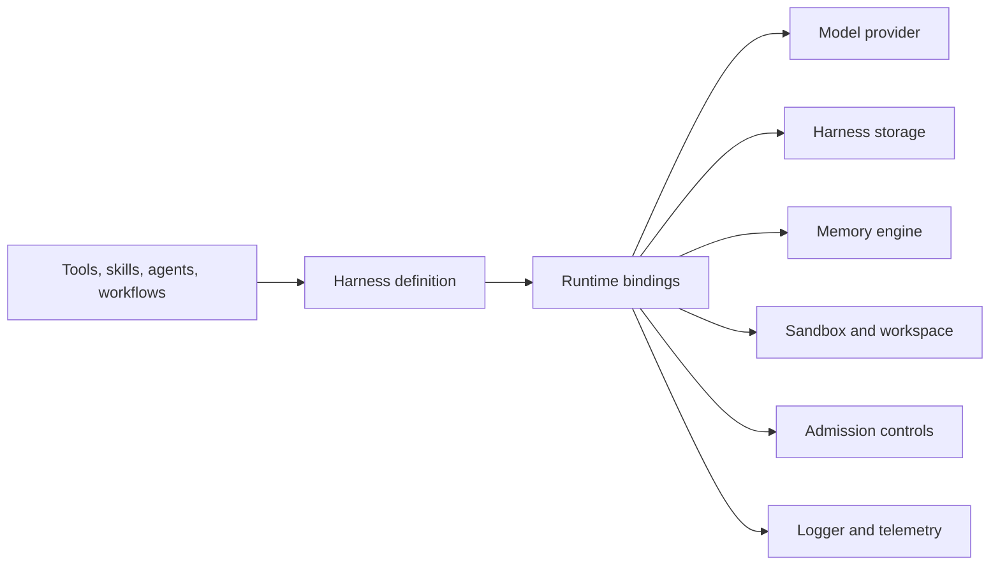

# Extend Harness

Harness keeps application definitions portable and puts infrastructure behind
small runtime ports. Build an adapter when an existing package does not support
the provider or platform you operate.



## Model providers

Implement `ModelProvider` or extend `BaseModelProvider`. Translate Harness
requests into the provider SDK and normalize text, structured objects, streams,
tool calls, embeddings, reranking, media, token usage, and finish reasons.

Declare only capabilities the adapter can perform. An adapter without reranking,
for example, must omit `rerank` and must not advertise `rerank`. Preserve the
request signal and timeout, and use Harness error helpers to prevent raw provider
errors or response content from crossing the boundary.

Bind the adapter to model aliases at runtime:

```ts
const instance = await definition.getInstance({
  models: {
    primary: { provider: customProvider, model: 'provider-model-id' },
    embeddings: { provider: customProvider, model: 'provider-embedding-id' },
  },
})
```

Run the shared provider contracts plus provider-specific tests for request
translation, capability claims, cancellation, retry classification, schema
validation, tool-call accumulation, and safe errors.

## Harness storage

Implement `HarnessStorage` when sessions, messages, run events, durable
checkpoints, leases, waits, and approval receipts must outlive the process.
These records form one consistency boundary and belong in one transactional
adapter.

The adapter must declare its capabilities and pass the shared storage contract.
Use optimistic concurrency or transactions exactly where the port requires
them. Never silently weaken run creation, leases, idempotency, or immutable
event ordering.

## Memory engines

Implement `MemoryEngine` for an external key/value, text, vector, hybrid, or
graph-backed memory system. The engine performs backend I/O; Core owns input
validation, scope binding, telemetry, content-capture policy, and error
normalization.

Declare exact `memory.*` capabilities, honor `ctx.signal`, and pass
`memoryEngineContract` from `@purista/harness/testing`:

```ts
import { memoryEngineContract } from '@purista/harness/testing'

memoryEngineContract(() => createMemoryEngineForTest())
```

Definitions request memory capabilities. The concrete engine is supplied only
to `getInstance({ memory })`.

## Sandbox adapters

Implement `Sandbox` and `SandboxSession` for containers, remote execution, or a
custom filesystem policy. A session declares executor availability explicitly:

- `executor: 'unavailable'` for file-only sessions;
- `executor: 'available'` when `exec(...)` is implemented;
- `sandbox.spawn` only when a persistent child process can be started safely.

Snapshot-capable adapters implement the matching snapshot, resume, and
hibernate operations and advertise their capabilities. A definition declares
the capabilities it needs:

```ts
const workspaceAgent = defineAgent('workspaceAgent', {
  instructions: 'Inspect and update the isolated workspace.',
  tools: [builtInTools.read, builtInTools.write],
  sandbox: { group: 'workspace' },
  workspace: true,
})

const definition = defineHarness({ name: 'workspaceApp' }).addAgent(workspaceAgent)
const instance = await definition.getInstance({
  model: { provider, model: 'gpt-5-mini' },
  sandbox: customSandbox,
  workspace: customDurableWorkspace,
  storage,
})
```

If an adapter supports built-in text search, advertise `sandbox.text_search`
and implement `searchText(request)` where the files live. Validate requests with
`validateSandboxTextSearchRequest`, implement the portable `safe_regex_v1`
language with a non-backtracking engine, return stable ordering, and report
incomplete results and limit reasons. Never pass patterns or paths through shell
interpolation.

Run `sandboxContract`, `sandboxTextSearchContract`, and, where applicable,
`durableWorkspaceContract` from `@purista/harness/testing`. Add platform tests
for tenant isolation, resource enforcement, cancellation, cleanup, and stale
fencing.

## Admission controls

Model and agent admission ports bound runtime concurrency and rate-limit
pressure without changing portable definitions. Implement them as lease-based,
cancellation-aware controls and release leases in every terminal path.

```ts
const instance = await definition.getInstance({
  model: { provider, model: 'gpt-5-mini', admission: modelAdmission },
  agentAdmission,
})
```

Queue policy remains deployment configuration. Agent and workflow definitions
still declare their own loop, call, and parallelism budgets.

## Host-aware tools

Portable `defineTool` handlers see only declared Harness resources. A framework
integration may additionally create branded `HostToolDefinition` values. This
is the extension point for a PURISTA helper that adds trusted message identity,
service resources, and address-first `invoke`, `enqueue`, and `emit` functions.

Host tools execute only in the integrator-owned hosted runtime. Standalone
Harness rejects them. Keep the host context private to the integration package;
definitions should contain references and schemas, never live service clients.

## Guardrails and governance

Guardrails attach through the `AgentGuardrailsBinding` contract. An addon should
project requirements during graph compilation and execute at the documented
input, output, tool-input, tool-output, or explicit retrieval boundary.

Governance policies use the public evaluator contracts and run before a tool
effect. They must fail closed, use authenticated identity from the host, and
emit content-free decision evidence. External policy clients belong at the
composition root rather than inside prompts or model-produced input.

## Reusable definition catalogs

Package definitions with `defineCatalog`:

```ts
const supportCatalog = defineCatalog('support', {
  agents: [supportAgent],
  workflows: [triageWorkflow],
})

const definition = defineHarness({ name: 'application' }).use(supportCatalog)
```

Catalogs contain no runtime clients. Harness recursively collects referenced
tools, skills, MCP servers, agents, and workflows, preserves exact types, and
rejects conflicting identities.

## Release requirements

An adapter package should:

- depend on or peer-depend on the compatible `@purista/harness` range;
- export compiled ESM and TypeScript declarations;
- document a published `npm install` command and one current v4 example;
- run shared contracts against the same Core version as its consumers;
- avoid importing Core source or internal paths;
- document capabilities, lifecycle ownership, failure behavior, security, and
  provider-specific operational limits.
