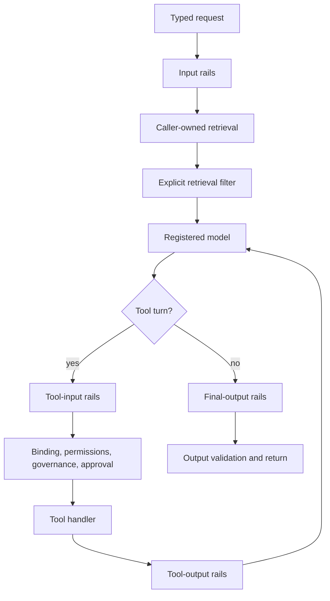

# Guardrails

`@purista/harness-guardrails` is an optional, typed addon for default-loop
agents. It compiles one inline TypeScript object into ordered, fail-closed
controls. The addon does not set up providers, servers, or vector stores.

Start with [content decisions, approval, and durable review](./decisions-and-approval.md)
and the [tested composition](../../examples/guardrails/README.md). A rail block
is a content decision: it is neither an approval request nor durable suspension.

## Lifecycle and coverage



Input, output, tool-input, and tool-output rails attach automatically only to
an attached default-loop agent. Retrieval stays application-owned: call
`filterRetrievedChunks(...)` after retrieval. Direct `ctx.models.*` calls and
custom-handler agents are outside automatic coverage, and `attach(...)` rejects
custom handlers.

Every phase runs in configured order. A transform becomes the next rail's
input. A block, missing action, malformed action result, timeout, detector or
codec failure, or cancellation failure stops the protected path. Rails do not
grant authority, undo an effect, or inspect opaque provider reasoning.

## Define the inline configuration and actions

The configuration has only `rails` and optional `sensitiveData`. `rails`
defaults to `{}`. Each phase uses an ordered `flows` list whose identifiers are
checked against the supplied action map and the action's declared phase.

```ts
import { defineHarness, inMemorySandbox } from '@purista/harness'
import { defineGuardrailAction, defineGuardrails } from '@purista/harness-guardrails'
import { z } from 'zod'

const redactInput = defineGuardrailAction({
	phase: 'input',
	valueSchema: z.string(),
	evaluate: ({ value }) =>
		value.includes('[secret]')
			? {
					decision: 'transform',
					target: 'user_message',
					value: value.replaceAll('[secret]', '[redacted]'),
					reasonCode: 'secret_redacted',
				}
			: { decision: 'allow' },
})
const validatePublish = defineGuardrailAction({
	phase: 'tool_input',
	tools: ['publish_note'],
	valueSchema: z.strictObject({ message: z.string() }),
	mayTransform: false,
	evaluate: ({ value }) =>
		value.message.includes('[blocked]') ? { decision: 'block', reasonCode: 'unsafe_note' } : { decision: 'allow' },
})
const redactOutput = defineGuardrailAction({
	phase: 'output',
	valueSchema: z.string(),
	evaluate: ({ value }) => ({
		decision: 'transform',
		target: 'bot_message',
		value: value.replaceAll('[secret]', '[redacted]'),
		reasonCode: 'secret_redacted',
	}),
})
const rails = defineGuardrails({
	config: {
		rails: {
			input: { flows: ['redact input'] },
			tool_input: { flows: ['validate publish'] },
			output: { flows: ['redact output'] },
		},
	},
	actions: { 'redact input': redactInput, 'validate publish': validatePublish, 'redact output': redactOutput },
})

const harness = defineHarness({ name: 'safe-notes' })
	.sandbox(inMemorySandbox())
	.models({ assistant: { provider, model: 'assistant', capabilities: ['object', 'tool_use'] } })
	.tool('lookup_status', {
			description: 'Read a public status.',
			input: z.strictObject({ ticket: z.string() }),
			output: z.strictObject({ status: z.string() }),
			handler: async (_ctx, { ticket }) => ({ status: `Status for ${ticket}` }),
	})
	.tool('publish_note', {
			description: 'Publish a reviewed note.',
			input: z.strictObject({ message: z.string() }),
			output: z.strictObject({ published: z.boolean() }),
			handler: async (_ctx, _input) => ({ published: true }),
	})
	.tool('unrelated_tool', {
			description: 'An action not selected by this rail.',
			input: z.strictObject({ id: z.string() }),
			output: z.strictObject({ id: z.string() }),
			handler: async (_ctx, input) => input,
	})
	.agent('support', {
		model: 'assistant',
		input: z.string(),
		output: z.string(),
		instructions: 'Use the available tools when needed.',
		tools: ['lookup_status', 'publish_note', 'unrelated_tool'],
		guardrails: rails,
	})
	.build()
```

Native tools must be registered through the builder-local `tool(...)` helper.
That helper keeps input/output schema and handler inference together and rejects
raw native tool objects during `.tools(...)` registration. MCP tool literals remain their own
integration boundary.

`defineGuardrailAction(...)` returns an opaque action token. Its evaluator
receives a phase-specific value; an action with `mayTransform: false` cannot
return a transform. Tool-input and tool-output actions must declare a nonempty
`tools` selector; their `valueSchema` must match the selected tool value.
Extracted callbacks should use the exported function-property types when needed;
arrow conversion is not a general rule.

## Phase values and action results

| Phase | Protected value | Transform target | Automatic attachment |
| --- | --- | --- | --- |
| `input` | Parsed user input | `user_message` | Yes |
| `output` | Final candidate only | `bot_message` | Yes |
| `tool_input` | Wire tool arguments before binding | `tool_input` | Yes |
| `tool_output` | Validated handler result | `tool_output` | Yes |
| `retrieval` | Caller-supplied JSON chunks | `relevant_chunks` | Explicit call |

An action returns `{ decision: 'allow' }`, `{ decision: 'block', reasonCode }`,
or a phase-targeted transform. Keep `reasonCode` stable and content-free: it is
appropriate for a metric, trace, or log, unlike prompts, matched text, or model
output.

| Stage | Guarantee |
| --- | --- |
| Before model input | Input rails complete before instructions/transcript construction. |
| Before a tool effect | Tool-input rails complete before binding, permission, governance, approval, and handler dispatch. |
| After a tool result | Tool-output rails see only schema-validated handler output. |
| Before returned output | Output rails see only the final candidate before final output validation. |

Guardrails and agent schemas are intentionally separate. A rail action's
`valueSchema` validates the value it protects; it does not automatically prove
compatibility with every selected agent or tool schema. Select tools explicitly
and use an exact value schema or a reviewed sensitive-data codec for structured
values.

## Model checks and retrieval

`modelCheckRail` uses a direct, already-registered Harness model alias. It
does not resolve aliases indirectly or create a provider.

```ts
const rails = defineGuardrails({
	config: { rails: { input: { flows: ['safety check'] } } },
	actions: {
		'safety check': modelCheckRail({
			phase: 'input',
			model: 'safety',
			instructions: 'Return whether the input is allowed.',
		}),
	},
})
```

The model alias must be present in the harness. `build()` checks active rail
requirements before a session, provider request, detector inspection, tool
call, or approval request occurs. For retrieval, keep storage and ranking in
application code and filter already-retrieved JSON values explicitly:

```ts
const safeChunks = await rails.filterRetrievedChunks(chunks, {
	models: ctx.models,
	signal: ctx.signal,
	logger: ctx.logger,
})
```

## Sensitive data and structured tools

Choose and construct a `SensitiveDataDetector` at the application composition
root, then bind it to actions. Policies are inline camelCase values.

```ts
const sensitiveDataActions = createSensitiveDataActions({ detector })
const rails = defineGuardrails({
	config: {
		rails: { input: { flows: ['mask sensitive data on input'] } },
		sensitiveData: { input: { entities: ['EMAIL_ADDRESS'], maskToken: '<MASKED>', scoreThreshold: 0.6 } },
	},
	actions: sensitiveDataActions,
})
```

For a structured tool value, use `sensitiveDataToolRail(...)` with a selected
tool, exact `valueSchema`, and a `SensitiveDataValueCodec`. The codec extracts
only approved text fields and reconstructs only those fields after masking.
The addon never recursively scans arbitrary tool JSON.

Detector failures, malformed results, codec failures, timeout, and cancellation
fail closed. Operational evidence contains stable reason/failure codes, not
inspected text, offsets, credentials, model output, or local paths. See the
[runnable example](../../examples/guardrails/README.md) for input, tool-input,
tool-output, final-output, sensitive-data, approval, and zero-effect preflight
coverage.

## Observability and limits

Each evaluation emits an OpenInference `GUARDRAIL` span, a counter, and a
duration metric with its final outcome. Blocks are successful guardrail
evaluations; failures are error spans. Use `observability` for standalone
retrieval calls when process-level logs/traces are needed.

Rails use a 10-second fail-closed action budget by default; override it with
`actionTimeoutMs` or one action's `timeoutMs`. Attached rails also honor the
enclosing run/tool deadline and cancellation signal. They do not replace
application authentication, authorization, tenancy, rate limits, business
validation, governance policies, or approvals.
