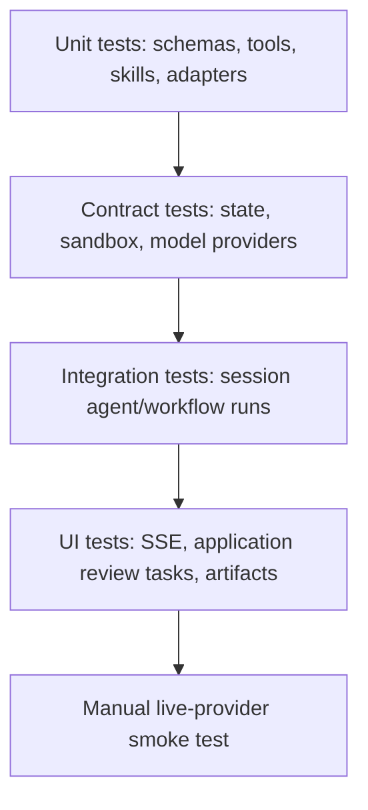

# Testing Guide

Test harness applications without calling external model providers by injecting
fake providers, fake stores, and local fixtures.

## Test Pyramid



## Default Repo Checks

```bash
npm run lint
npm run build
npm test
npm run test:coverage
npm run test:types
npm run test:contracts
npm run test:integration
npm run test:failure
```

`npm run test:coverage` enforces the harness package coverage gate. The current
core gate is statements `80`, branches `75`, functions `80`, and lines `80`.

## Test With A Fake Model Provider

```ts
const provider = {
  id: 'fake',
  genAiSystem: 'fake',
  async object() {
    return {
      object: { answer: 'fake answer', citations: [] },
      usage: { inputTokens: 1, outputTokens: 1, totalTokens: 2 },
      finishReason: 'stop'
    }
  }
}

const harness = createAppHarness(provider)
const session = await harness.getSession('test')
await expect(session.agents.answerer.prompt({ question: 'hi' }))
  .resolves.toMatchObject({ answer: 'fake answer' })
```

## Test Streaming Events

```ts
const events = []
for await (const event of session.workflows.audit.stream({ scope: 'all' })) {
  events.push(event.type)
}

expect(events).toContain('run.started')
expect(events).toContain('run.finished')
```

For model streaming behavior, queue provider stream chunks and assert both
privacy modes. A consumed `textStream(...)` / `objectStream(...)` call should
not produce model partial run events by default. A call with
`{ emitRunEvents: true }` should produce `model.delta` for text streams and
`model.object.partial` plus final `model.object` for object streams. Plain
`text(...)` / `object(...)` calls should not produce partial events. For
public stream tests, assert the grouping metadata too: generated `streamId`
stability per stream invocation, distinct ids across parallel streams,
`modelAlias`, and available `workflowId` / `agentId`.

## Test Tools

Call TypeScript tool handlers with a small context object and a temporary store.
Assert both successful output and validation failure behavior.

## Test Skills

Skill tests should cover both catalog behavior and runtime activation:

- valid `SKILL.md` frontmatter is parsed without inlining the body into the
  system prompt;
- invalid strict frontmatter fails before the body can be mounted or logged;
- discovery reports trust, collisions, and scan-limit diagnostics;
- an agent with `skills: [...]` has the `read` built-in available before model
  I/O starts;
- reading `/skills/<name>/SKILL.md` returns the mounted skill file and repeated
  reads do not remount duplicate copies.

Use a temporary skill directory and a scripted model for end-to-end tests. The
first model response should call the `read` tool for `/skills/<name>/SKILL.md`;
the second response should return the final validated object. Assert the first
request contains the catalog entry and does not contain the skill body.

## Test Durable Workspace Adapters

Workspace replay adapters should pass the shared contract before application
integration tests use them:

```ts
import { durableWorkspaceContract } from '@purista/harness/testing'

durableWorkspaceContract(() => makeDurableWorkspace())
```

Also test application startup with `.requires(...)` so missing
`storage.workspace_checkpoint`, `workspace.durable`, `workspace.resume`, or
cleanup/retention/quota capabilities fail before work is queued.

## Test evaluation scorers

Use the testing subpath's predicate factory for deterministic scorer fixtures;
it creates the same `EvaluationScorer` contract used by `runEvaluation` and
`scoreEvaluation`:

```ts
import { createDeterministicEvaluationScorer } from '@purista/harness/testing'

const hasPolicy = createDeterministicEvaluationScorer({
  id: 'contains-policy',
  version: 'v1',
  dimension: { id: 'mentions-policy', kind: 'boolean' },
  evaluate: (observation) => ({
    outcome: 'scored',
    dimensionId: 'mentions-policy',
    kind: 'boolean',
    value: observation.output.answer.includes('policy'),
  }),
})
```

Test scorer outcomes separately from task behavior. Cover a scored result, a
legitimate `not_applicable` or `inconclusive` result where relevant, and a
technical scorer failure. Use a fake model/provider for deterministic task
tests; use `runEvaluation` only when exercising execution, scheduling, and
result integration. See [Evaluating AI systems](./evaluating-prompts.md) and
the [PURISTA evaluation handbook](https://purista.dev/handbook/harness/test-and-evaluate/)
for the complete workflow.

## Test MCP

Use local fake MCP servers for contract tests. Stdio MCP should prove:

- the command runs through the sandbox executor;
- `SandboxNoExecutorError` is thrown when no executor is available;
- input and output schemas are validated;
- timeout, cancellation, process failure, and retry behavior are covered.

HTTP MCP should prove auth failures, protocol failures, schema validation, and
normal success.

## Test Application Review Tasks

For application-owned human-in-the-loop flows:

- assert no mutation happens before approval;
- assert answer choices are submitted to the backend;
- assert decisions are idempotent;
- assert stale review ids and stale run ids fail cleanly.

The Living Wiki example implements and covers these application patterns in
`examples/living-wiki-jaeger/src/backend/app.test.ts` and
`examples/living-wiki-jaeger/src/frontend/app.ui.test.tsx`.
