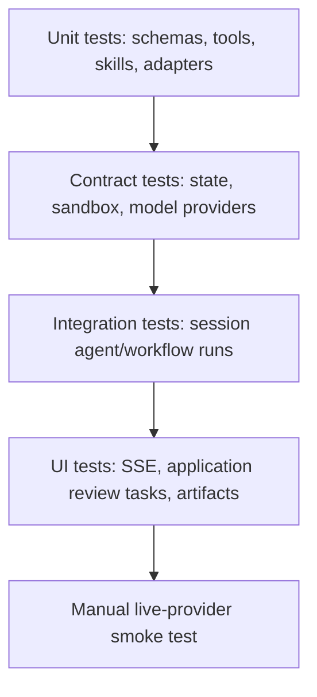

# Testing Guide

Test harness applications without calling external model providers by injecting
fake providers, fake stores, and local fixtures.

## Test Pyramid



## Default Repo Checks

```bash
npm run lint
npm run build
npm test
npm run test:coverage
npm run test:types
npm run test:contracts
npm run test:integration
npm run test:failure
```

`npm run test:coverage` enforces the harness package coverage gate. The current
core gate is statements `80`, branches `75`, functions `80`, and lines `80`.

## Test With A Fake Model Provider

```ts
const provider = new FakeModelProvider({ strict: true })
provider.enqueueObject({
	object: { answer: 'fake answer', citations: [] },
	usage: { inputTokens: 1, outputTokens: 1, totalTokens: 2 },
	finishReason: 'stop',
})

const instance = await definition.getInstance({
	model: { provider, model: 'fake' },
})
const session = await instance.getSession('test')
await expect(session.agents.answerer.run({ question: 'hi' })).resolves.toMatchObject({
	status: 'completed',
	runId: expect.any(String),
	output: { answer: 'fake answer' },
})
provider.assertExhausted()
await instance.close()
```

## Test Streaming Events

```ts
const events = []
for await (const event of session.workflows.audit.stream({ scope: 'all' })) {
	events.push(event.type)
}

expect(events).toContain('run.started')
expect(events).toContain('run.finished')
```

This test consumes the portable `ExecutionEvent` contract. Completed and
interrupted terminal outcomes use the same `RunOutcome` shape returned by an
aggregate call; failed and cancelled terminals contain normalized serialized
errors.

For model streaming, queue deterministic provider chunks and consume the
target's `.stream(...)` result. Assert the public `ExecutionEvent` sequence,
including text deltas or object snapshots, tool lifecycle events, and exactly
one terminal `run.finished` event. Also assert cancellation reaches the
provider signal and that an interrupted approval never executes the protected
tool before resume.

For public stream tests, assert only portable execution events and test the
selected protocol adapter, such as `@purista/harness-ai-sdk-ui/v1`, at its own
HTTP/SSE boundary.

## Test Tools

Call TypeScript tool handlers with a small context object and a temporary store.
Assert both successful output and validation failure behavior.

## Test Sandbox Adapters

All adapters run the base filesystem/lifecycle suite. Adapters that advertise
bounded search run the additional search suite:

```ts
import { sandboxContract, sandboxTextSearchContract } from '@purista/harness/testing'

sandboxContract(() => createSandbox(), { executor: 'unavailable' })
sandboxTextSearchContract(() => createSandbox())
```

The search contract covers literal and `safe_regex_v1` matching, deterministic
ordering, cancellation, unsupported syntax, adversarial patterns, and every
size/count limit. Keep provider-level tests for facts a generic contract cannot
observe, such as executing inside the correct pod, blocked cross-tenant paths,
CPU/memory limits, and content-free telemetry.

## Test Skills

Skill tests should cover definition behavior and runtime activation:

- valid `SKILL.md` frontmatter is parsed without inlining the body into the
  system prompt;
- invalid strict frontmatter fails before the body can be mounted or logged;
- discovery reports trust, collisions, and scan-limit diagnostics;
- an agent with `skills: [...]` has the synthesized `read_skill` tool available before model
  I/O starts;
- reading `SKILL.md` through `read_skill({ name, path })` returns the reviewed
  Skill file and repeated reads do not remount duplicate copies.

Use a temporary skill directory and a scripted model for end-to-end tests. The
first model response should call `read_skill` with the Skill name and `path: 'SKILL.md'`;
the second response should return the final validated object. Assert the first
request contains the catalog entry and does not contain the skill body.

## Test Durable Workspace Adapters

Workspace replay adapters should pass the shared contract before application
integration tests use them:

```ts
import { durableWorkspaceContract } from '@purista/harness/testing'

durableWorkspaceContract(() => makeDurableWorkspace())
```

Also test instance creation with a definition that declares durable workspace
requirements, so missing
`storage.workspace_checkpoint`, `workspace.durable`, `workspace.resume`, or
cleanup/retention/quota capabilities fail before work is queued.

## Test evaluation scorers

Use the testing subpath's predicate factory for deterministic scorer fixtures;
it creates the same `EvaluationScorer` contract used by `runEvaluation` and
`scoreEvaluation`:

```ts
import { createDeterministicEvaluationScorer } from '@purista/harness/testing'

const hasPolicy = createDeterministicEvaluationScorer({
	id: 'contains-policy',
	version: 'v1',
	dimension: { id: 'mentions-policy', kind: 'boolean' },
	evaluate: observation => ({
		outcome: 'scored',
		dimensionId: 'mentions-policy',
		kind: 'boolean',
		value: observation.output.answer.includes('policy'),
	}),
})
```

Test scorer outcomes separately from task behavior. Cover a scored result, a
legitimate `not_applicable` or `inconclusive` result where relevant, and a
technical scorer failure. Use a fake model/provider for deterministic task
tests; use `runEvaluation` only when exercising execution, scheduling, and
result integration. See [Evaluating AI systems](./evaluating-prompts.md) and
the [PURISTA evaluation handbook](https://purista.dev/handbook/harness/test-and-evaluate/)
for the complete workflow.

## Test MCP

Use local fake MCP servers for contract tests. Stdio MCP should prove:

- the command runs through the sandbox executor;
- `SandboxNoExecutorError` is thrown when no executor is available;
- input and output schemas are validated;
- timeout, cancellation, process failure, and retry behavior are covered.

HTTP MCP should prove auth failures, protocol failures, schema validation, and
normal success.

## Test Application Review Tasks

For application-owned human-in-the-loop flows:

- assert no mutation happens before approval;
- assert answer choices are submitted to the backend;
- assert decisions are idempotent;
- assert stale review ids and stale run ids fail cleanly.

The Living Wiki example implements and covers these application patterns in
`examples/living-wiki-jaeger/src/backend/app.test.ts` and
`examples/living-wiki-jaeger/src/frontend/app.ui.test.tsx`.
