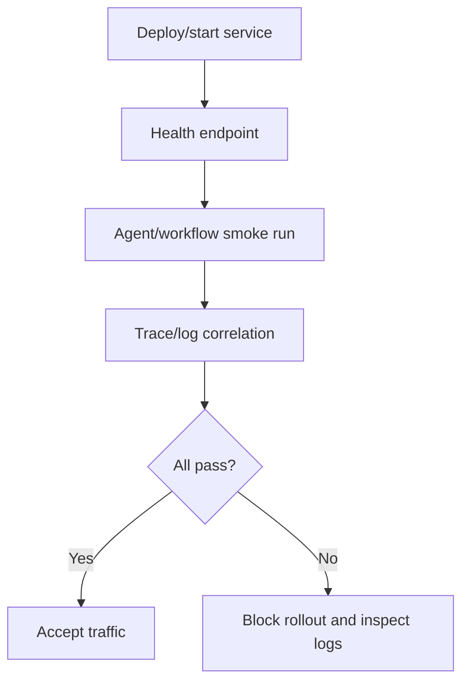

# Operations Runbook

Use this runbook for local verification, service readiness, observability, and
failure triage.

## Standard Verification Gates

```bash
npm run lint
npm run build
npm test
npm run test:coverage
npm run test:types
npm run test:contracts
npm run test:integration
npm run test:failure
npm run verify:architecture
```

For sandbox package changes, also run `npm run verify:sandbox-packages`. This
opt-in contributor check builds and packs Harness and the Docker addon, installs
their tarballs into an isolated temporary consumer, and checks runtime behavior
and public declarations without Framework or source aliases. It uses cached npm
dependencies (`--offline`) and the repository compiler; populate the dependency
cache first. It does not require Docker, publish packages, or prove a registry
release. Its temporary consumer is removed when the check finishes.

For PostgreSQL or Kubernetes production-adapter changes, also run
`npm run verify:production-adapters`. It packs Harness plus both adapters,
installs only their tarballs into an isolated consumer, typechecks the public
declarations, checks package export boundaries, and confirms neither addon
pulls in PURISTA Core. Run credential-gated PostgreSQL and Kubernetes live
suites separately against disposable infrastructure.

## Service Readiness

Before exposing a harness-backed service:

- verify session creation;
- verify direct agent invocation;
- verify every workflow entrypoint;
- verify tool and MCP failures map to harness errors;
- verify cancellation and timeout behavior;
- when `@purista/harness-policy-opa` is configured, verify the fixed OPA
  destination and `/health?bundles&plugins` readiness, then run one expected
  allow and deny decision against the deployed bundle;
- when PostgreSQL storage is configured, verify schema migration, two-pool
  contention, expired-lease takeover, stale-worker fencing, and duplicate wait
  signals before accepting durable work;
- when Kubernetes execution is configured, verify namespace/RBAC denial,
  restricted admission, default-deny egress, quota/limits, Pod loss, snapshot
  restore, stale attachment rejection, and idempotent cleanup;
- verify `harness.shutdown()` closes adapters and MCP runners.



## Observability

Use structured logs and OpenTelemetry together.

| Signal | What To Look For |
|---|---|
| Logs | `run_id`, `session_id`, `agent_id`, `workflow_id`, `tool_id`, error code, retriable flag. |
| Traces | request, session, workflow, agent, model, tool, and sandbox spans. |
| Events | `run.started`, `tool.started`, `tool.finished`, `agent.finished`, `run.finished`, overflow events. |

Jaeger local example:

```bash
cd examples/living-wiki-jaeger
npm install
npm run jaeger
```

Set:

```env
OTEL_EXPORTER_OTLP_ENDPOINT=http://localhost:4318
```

## Common Failures

| Symptom | Likely Cause | Action |
|---|---|---|
| `SessionBusyError` | Two runs started in one session. | Use distinct session IDs or wait for the current run. |
| `OperationTimeoutError` | Run/model/tool exceeded budget. | Tune `defaults`, inspect provider/tool latency. |
| `OperationCancelledError` | Caller or parent run aborted the operation. | Check disconnect/shutdown paths and `InvokeOptions.signal` propagation. |
| `ValidationError` | Input/output schema mismatch. | Check the application boundary and safe issue count metadata; vendor messages, paths, values, and schemas are intentionally not logged or serialized. |
| `ModelError` | Provider HTTP/network/error response. | Inspect normalized metadata: status, provider type, request id, retry kind, retry-after, rate-limit summary, body summary. |
| `SandboxNoExecutorError` | Command execution requested in files-only sandbox. | Use `bashSandbox()` or disable exec-backed tools. |
| `HarnessConfigError` with missing `sandbox.text_search` | An agent enabled built-in `grep`, but the selected custom sandbox did not declare bounded search. | Implement and contract-test `searchText(...)`, or remove `grep` from that agent. Do not add a file-download or shell fallback. |
| `SandboxStateLostError` | An existing sandbox scope or recoverable workspace binding is unavailable. | Do not retry by creating empty state; surface recovery failure or restart from an application-approved checkpoint. |
| `McpProtocolError` | MCP list/call/protocol failure. | Check MCP command/url, schema, timeout, stderr/logs. |
| `McpAuthError` | HTTP MCP auth failed. | Rotate/check token and auth config. |

## MCP Operations

For `mcp_stdio`:

- install and execution happen inside the sandbox;
- `install.command` should be idempotent;
- use explicit timeouts;
- do not rely on host-local binaries unless the sandbox exposes them;
- verify no secrets are logged.

For `mcp_http`:

- monitor endpoint availability;
- rotate auth secrets;
- test non-2xx responses;
- verify request bodies are not logged by default.

## Recovery

Sandbox state loss is not permission to create an empty replacement. Durable
file recovery requires the latest committed workspace checkpoint; an interrupted
attempt without one needs an application decision. A cleanup warning after a
terminal run does not undo its result. Retry the adapter's idempotent cleanup
under operator policy; do not replay completed business work for cleanup.

1. Identify `run_id` from the UI, logs, or API response.
2. Inspect structured logs for the matching `run_id`.
3. Inspect trace if `traceId` or Jaeger link is present.
4. Check final `run.finished` event for normalized error metadata.
5. Fix provider/tool/config issue.
6. Re-run a smoke test.
7. Call `harness.shutdown()` during controlled process shutdown.
