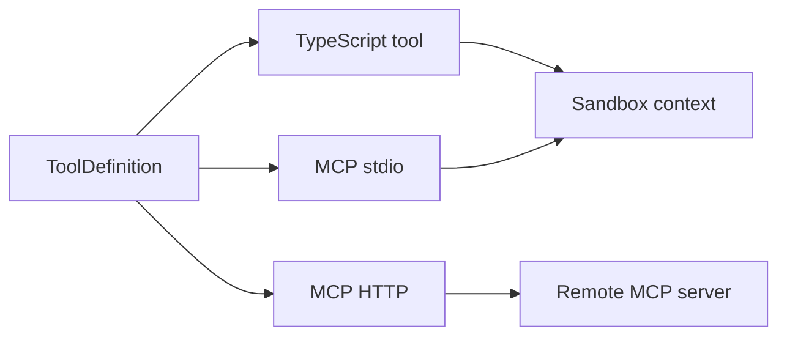

# Public API Overview

This page summarizes the public surface most application developers need. The
interfaces below are the supported API entry points for applications and
adapter packages.

## Packages

| Package | Purpose |
|---|---|
| `@purista/harness` | Core runtime: builder, sessions, agents, workflows, tools, sandbox, state, telemetry, errors. |
| `@purista/harness-guardrails` | Optional typed content rails; concrete privacy detectors remain separate addons. |
| `@purista/harness-openai` | OpenAI model provider adapter. |
| `@purista/harness-anthropic` | Anthropic model provider adapter. |
| `@purista/harness-bedrock` | Amazon Bedrock model provider adapter. |
| `@purista/harness-azure-foundry` | Azure AI Foundry model provider adapter. |
| `@purista/harness-agent-plugins` | Opt-in Agent Plugins v1 inspection and explicit, application-owned Skill/MCP bindings. |
| `@purista/harness-memory-sqlite` | Local durable SQLite/FTS5 memory; optional explicit sqlite-vec exact vectors. |
| `@purista/harness-memory-postgres` | PostgreSQL 16+ and pgvector memory engine. |
| `@purista/harness-memory-redis` | Redis Search memory engine with optional vector index. |
| `@purista/harness-memory-nats` | JetStream KV memory engine without relevance search. |

## Application API

```ts
const harness = defineHarness({ name: 'my-service' })
  .storage(...)
  .workspace(...)
  .memory(...)
  .requires(...)
  .models(...)
  .tools(...)
  .skills(...)
  .agents(...)
  .workflows(...)
  .build()

const session = await harness.getSession('tenant:user:thread')
const answer = await session.agents.answerer.prompt(input)
const report = await session.workflows.research_report.prompt(input)
await harness.shutdown()
```

`storage(...)`, `workspace(...)`, `memory(...)`, and `requires(...)` are optional. Omit them for
the simple in-process defaults.

## Main Types

| Type | What It Represents |
|---|---|
| `Harness<S>` | Built runtime with `getSession`, `shutdown`, and `$infer`. |
| `HarnessInspection` | Data-only adapter and capability snapshot returned by `harness.inspect()`. |
| `Session<S>` | Operational context exposing `agents`, `workflows`, `childTasks`, `history`, `memory`, `getRunSummary`, `release`, and destructive `close`. |
| `AgentInvoker` | `prompt(input)` and `stream(input)` for direct agent runs. |
| `WorkflowInvoker` | `prompt(input)` and `stream(input)` for workflow runs. |
| `WorkflowDelegationPolicy` | Optional per-workflow child-agent allowlist, fan-out budgets, and model-alias policy. |
| `WorkflowChildTasks` / `ChildTaskHandle` | Typed workflow-owned isolated background tasks with lifecycle status and cancellation. |
| `ContinuableChildTaskHandle` | In-process isolated task conversation with serialized `send(...)` turns and explicit `close()`. |
| `GovernanceConfig` | Optional policy layer for tool exposure, tool-call deny/audit, shadow mode, and approvals. |
| `GovernancePolicyEvaluator` | Adapter interface for external policy engines. |
| `GovernanceDecision` | Strict policy result: `effect` and optional `reasonCode`/`ruleId`; evidence is runtime-owned. |
| `DecisionEvidence` / `createDecisionEvidence` | Shared content-free source, phase, optional reason code, and deterministic occurrence identity. |
| `DecisionExecutionContext` | Linked `signal` and absolute `deadline` for bounded callbacks. |
| `GovernanceApprovalRequest` / `GovernanceApprovalSubject` | One correlated prepared tool subject plus approval id and safe demands. |
| `GovernanceApprovalProvider` / `GovernanceApprovalResult` | Shared immediate callback returning approved/rejected and optional reason code. |
| `AgentExecutionInterceptor` | Phase-specific default-loop hooks; `afterModel` allows/blocks, `beforeOutput` owns final transforms. |
| `ProviderContinuation` / `ProviderContinuationItem` | Transient provider-neutral slots for opaque state and canonical tool-call reconstruction. |
| `ExternalWaitOutcome` / `ExternalWaitResolved` | Durable terminal wait outcome and resolved metadata, separate from application review/execution state. |
| `ModelProvider` | Adapter interface implemented by provider packages for text, object, multimodal, embedding, and rerank operations. |
| `HarnessStorage` | Persistence port for sessions, messages, runs, events, workflow checkpoints, leases, and external waits. |
| `MemoryEngine` / `MemoryFacade` | Pluggable canonical-record storage port and scoped runtime facade. |
| `Sandbox` / `SandboxSession` | One logical file and optional command boundary; `Sandbox.registerOwner` records authorized ownership before direct lifecycle work, while deployment topology stays adapter-private. |
| `SandboxScope` / `SandboxOwner` | Exact logical owner, partition, and lifetime used by `create`, `attach`, `restore`, and termination. |
| `SandboxPolicy` / `SandboxBindingOptions` | Application-selected sharing policy and Harness binding options; neither contains provider references. |
| `SandboxAdministration` | Explicit application-owned exact list/purge/sweep/snapshot cleanup and offboarding surface. |
| `ReadOnlyMountCapableSandboxSession` | Sandbox session that can stage immutable reviewed package assets for trusted stdio plugins. |
| `ToolDefinition` | TypeScript, MCP stdio, or MCP HTTP tool config. |
| `SkillDefinition` / `ResolvedSkill` | Skill directory binding and parsed runtime metadata. |
| `DiscoverSkillsOptions` / `DiscoveredSkills` | Client-style skill discovery input and diagnostics. |
| `AdapterCapability` | Stable non-model adapter capability id such as `sandbox.snapshot` or `storage.checkpoint`. |
| `DurableWorkspace` | Optional replay workspace contract linking runtime checkpoints to persisted workspace state. |
| `DurableReplayCheckpoint` | Adapter-neutral checkpoint payload that carries `workspaceRef`, `checkpointRef`, and optional `snapshotRef`. |
| `FeedbackRecord` | Optional feedback signal attached to harness-native ids. |

Sandbox identifiers and provider handles are opaque adapter internals. Register
an application-authorized owner before direct adapter lifecycle calls. Use
`SandboxAdministration` for bounded cleanup and offboarding; authorize it in
the application before calling it. A purge may report `cleanup_pending` and a
retry delay instead of claiming a resource was deleted. Never place provider
references, identities, cursors, file contents, or snapshots in logs/telemetry.

## Adapter Capabilities

```ts
const harness = defineHarness()
  .storage(inMemoryHarnessStorage())
  .workspace(durableWorkspace)
  .requires(['sandbox.fs', 'memory.persistent', 'storage.checkpoint', 'storage.workspace_checkpoint', 'workspace.durable'])
  .models(...)
  .agents(...)
  .build()

const inspection = harness.inspect()
console.log(inspection.capabilities)
```

`harness.inspect()` is synchronous and data-only. It does not open sessions,
call networks, or mutate adapters. Missing required adapter capabilities fail
during `build()` with `HarnessConfigError`. Memory adapter capabilities use the
same policy path, for example `memory.text_search`, `memory.vector_search`,
and `memory.persistent`.

## Tool Definitions



TypeScript tools validate with Zod before and after handler execution. Builtin
schemas and MCP adapters/schemas also prepare input once before permission,
policy, and approval. Tool-input transforms change wire arguments first;
handler-output validation precedes tool-output presentation rails. Read the
[decision table and exact lifecycle](../guides/decisions-and-approval.md) for
batch dispatch, deadlines, evidence, and durable review ownership.

## Skills

```ts
import { defineHarness, discoverSkills } from '@purista/harness'

const discovered = await discoverSkills({
  projectRoot: process.cwd(),
  trustedProjectRoots: [process.cwd()],
  includeUserAgentsDir: true
})

const harness = defineHarness({ name: 'assistant' })
  .skills({
    ...discovered.skills,
    'incident-responder': {
      directory: './src/skills/incident-responder',
      trust: 'trusted',
      source: 'application'
    }
  })
  .models(...)
  .agents(({ agent }) => ({
    triage: agent({
      model: 'fast',
      skills: ['incident-responder'],
      builtinTools: ['read'],
      instructions: 'Read relevant skills before answering.'
    })
  }))
  .build()
```

Skill prompts contain only catalog metadata and `/skills/<name>/SKILL.md`
locations. The full skill directory is mounted into the sandbox once per
session and is loaded through read-only filesystem tools.

MCP stdio tools:

- include `kind: 'mcp_stdio'`;
- can include `install`;
- run install and execution through the active sandbox executor.

MCP HTTP tools:

- include `kind: 'mcp_http'`;
- call a remote streamable HTTP MCP endpoint;
- support `none`, `bearer`, `oauth2`, `api_key`, and `basic` auth.

## Agent Loop Controls

Default-loop agents may declare `prepareStep` and `stopWhen`.

```ts
prepareStep: ({ step }) => step === 0
  ? { model: 'planner', activeTools: ['search'] }
  : { model: 'writer', activeTools: [] },
stopWhen: ({ step }) => step >= 2
```

`prepareStep` receives the current step number, selected model alias, messages,
tool specs, history, memory, metadata, checkpoints, and metrics. It may return
per-call overrides for `model`, `instructions`, `activeTools`, `messages`, and
model `call` options. `stopWhen` runs after a model response and before tool
execution; if it returns `true`, the response object is validated as the final
agent output.

## Run Events

Streaming invokers yield `RunEvent` values:

| Event | Meaning |
|---|---|
| `run.started` | Run record exists and execution began. |
| `fanout.started` / `fanout.finished` | Bounded workflow-local batch lifecycle. |
| `child_task.started` / `child_task.settled` | Content-free isolated task lifecycle in the child task's run. |
| `agent.started` / `agent.finished` | Agent lifecycle. |
| `tool.started` / `tool.finished` | Tool lifecycle and normalized errors. |
| `model.completed` | Sole generative model-call and token accounting event; independent of content admission. |
| `policy.exposure` / `policy.evaluated` | Safe exposure/execution decision evidence and enforcement state. |
| `approval.requested` | Approval occurrence correlation and safe `demands`, never the subject input. |
| `approval.finished` | Matching approval id and terminal outcome, optional safe reason/error code. |
| `model.message` | Persisted model message metadata. |
| `model.delta` | Text delta from a `textStream(...)` model call that opted in with `{ emitRunEvents: true }`. |
| `model.object.partial` | Structured partial from an `objectStream(...)` model call that opted in with `{ emitRunEvents: true }`. |
| `model.object` | Final object from the default agent `object(...)` call or an opted-in `objectStream(...)` finish chunk. |
| `run.finished` | Final output or serialized error. |
| `stream.overflow` | Stream buffer dropped old events. |

`text(...)` and `object(...)` are final request-response operations and do not
produce partial run events. They do emit `model.completed` on successful
invocation, including direct and nested calls. Fully consumed successful model
streams also emit it once, independent of `emitRunEvents`; failed attempts and
streams that later fail do not. Presentation events have no accounting role.
`textStream(...)` and `objectStream(...)` expose
provider chunks directly to workflow or custom agent-handler code. Those chunks
stay private to the run by default; harness mirrors supported chunks as
provider-neutral run events only when that model stream call passes
`{ emitRunEvents: true }`. `model.embedding.completed` and
`model.rerank.completed` are provider-neutral runtime events when the configured
provider path supports those operations.

Harness-emitted opted-in model stream events include generated `streamId` and
`modelAlias`. They also include `workflowId` and `agentId` when the stream call
is made from that scope. `streamId` is unique to the model stream invocation, so
parallel streams can be grouped independently.
They remain harness events, not a Vercel stream protocol.

Child-agent lifecycle events emitted from workflows include `workflowId`,
`delegationCallId`, `delegationDepth`, and `modelAlias`. Persisted payloads keep
that operational lineage while redacting prompts and outputs.

## Workflow Delegation

Workflows call registered agents through typed `ctx.agents.<id>(input, opts)`.
Child-agent calls are disabled by default. Opt in per workflow:

```ts
.workflows(({ workflow }) => ({
  publish: workflow({
    input,
    output,
    delegation: { agents: ['writer'] },
    handler: async (ctx) => ctx.agents.writer(ctx.input)
  })
}))
```

If every workflow in a harness should be allowed to delegate, opt in globally:

```ts
.defaults({
  delegation: {
    enabled: true,
    maxChildAgentCalls: 32,
    maxParallelChildAgentCalls: 8,
    maxDepth: 1
  }
})
```

Use a workflow-local `delegation` policy to narrow the callable agents, raise or
lower fan-out budgets, and choose which model aliases may override a child
agent's default model:

```ts
.workflows(({ workflow }) => ({
  publish: workflow({
    input: z.object({ draft: z.string() }),
    output: z.object({ text: z.string(), approved: z.boolean() }),
    delegation: {
      agents: ['writer', 'reviewer'],
      maxChildAgentCalls: 4,
      maxParallelChildAgentCalls: 2,
      agentModelAliases: { reviewer: ['deep'] }
    },
    handler: async (ctx) => {
      const text = await ctx.agents.writer({ draft: ctx.input.draft })
      const review = await ctx.agents.reviewer(text, { model: 'deep' })
      return { text: text.text, approved: review.approved }
    }
  })
}))
```

Denied calls throw `DelegationPolicyError` with code
`DELEGATION_POLICY_ERROR`.

Policy fields:

- `enabled`: optional workflow switch; a `delegation` object enables delegation
  unless it sets `enabled: false`.
- `agents`: child-agent allowlist.
- `maxChildAgentCalls`: total calls per workflow run.
- `maxParallelChildAgentCalls`: active calls per workflow run.
- `maxDepth`: local delegation depth.
- `modelAliases`: workflow-wide model alias allowlist for child calls.
- `agentModelAliases`: per-child-agent model alias allowlists.

## Durable Step Retry

Workflow handlers can retry transient step failures before checkpoint commit:

```ts
await ctx.step('fetch-context', fetchContext, {
  retry: { maxAttempts: 3, minDelayMs: 250, maxDelayMs: 2_000 }
})
```

`retry: true` uses three total attempts with exponential backoff. Replayed
durable steps return the committed output and never re-run the step function.

## Run Summary

```ts
const summary = await session.getRunSummary(runId)
```

`getRunSummary` reads the configured `HarnessStorage` and returns status, start and
finish timestamps, model/tool/agent call counts, token totals, optional
cache/reasoning token details when providers report them, and any serialized
run error. It does not require an OpenTelemetry backend.

Persisted event payloads are redacted even when telemetry content capture is
enabled. Usage counts and operational metadata remain available for summaries
and dashboards.

## Invoke Options

```ts
await session.agents.answerer.prompt(input, {
  timeoutMs: 30_000,
  historyWindow: 20,
  traceparent: req.headers.get('traceparent') ?? undefined,
  tracestate: req.headers.get('tracestate') ?? undefined,
  metadata: { tenantId: 'tenant-a' }
})
```

`traceparent` and `tracestate` follow W3C Trace Context. Valid values become the
parent context for the root run span and all child spans. Invalid values are
ignored with a warning log and do not fail the run.

`metadata` is JSON-serializable scalar application context exposed to workflow
handlers and custom agent handlers. Do not put secrets, prompts, or user content
in metadata.

## Metrics

Workflow handlers, custom agent handlers, and TypeScript tool handlers receive a
scoped `ctx.metrics` helper:

```ts
interface Metrics {
  counter(name: string, value?: number, attrs?: SpanAttrs): void
  histogram(name: string, value: number, attrs?: SpanAttrs): void
  duration<T>(name: string, attrs: SpanAttrs | undefined, fn: () => Promise<T>): Promise<T>
}
```

Use it for application-owned measurements, for example queue sizes, business
outcomes, or workflow step durations. The helper records through the harness
OpenTelemetry meter and adds the active harness/session/run attributes.

Token usage remains on model spans using GenAI and OpenInference attributes.
When providers report them, cache-read, cache-creation, and reasoning token
details stay on the `TokenUsage` object and span attributes. The harness also
emits token usage metrics so aggregate usage can remain available even when
trace storage samples or drops spans.

## Memory

`session.memory` exposes session-scoped JSON memory. Run contexts also receive
`ctx.memory.application`, `ctx.memory.tenant()`, `ctx.memory.principal()`,
`ctx.memory.session`, `ctx.memory.run`, `ctx.memory.agent`, and
`ctx.memory.scope(...)`.

```ts
await ctx.memory.session.write('last_topic', { value: 'pricing' })
const last = await ctx.memory.session.read<{ value: string }>('last_topic')
const keys = await ctx.memory.session.list({ prefix: 'last_' })
```

The dependency-free process-local engine is the default. Durable engines
implement `MemoryEngine`, persist canonical records, declare truthful
`memory.*` capabilities, and live in `@purista/harness-memory-*` packages.
Text, semantic, and hybrid search are explicit operations; a requested mode
fails when its engine capability is absent.

## Model Provider Operations

Provider packages implement the operations they support and declare matching
alias capabilities:

```ts
interface ModelProvider {
  text?(req: TextRequest): Promise<TextResponse>
  textStream?(req: TextRequest): AsyncIterable<TextStreamChunk>
  object?<T>(req: ObjectRequest<T>): Promise<ObjectResponse<T>>
  objectStream?<T>(req: ObjectRequest<T>): AsyncIterable<ObjectStreamChunk<T>>
  embed?(req: EmbeddingRequest): Promise<EmbeddingResponse>
  rerank?(req: RerankRequest): Promise<RerankResponse>
}
```

Use `object` and `object_stream` for structured outputs. Use `embeddings` and
`rerank` for retrieval workflows; storage and retrieval policy stay outside
core.

Streaming methods return provider chunks to the caller. By default those chunks
are internal to the workflow or custom agent handler. When a public-facing model
stream should be forwarded through `session.*.stream(...)`, pass
`{ emitRunEvents: true }` to that specific model stream call. Application
SSE/WebSocket adapters can then forward a single run-event stream without
treating provider protocols as public API, while owning any UI labels or
client-facing event names.

Adapter authors extend `BaseModelProvider` and reuse the shared helpers
exported from the main entry (`toTokenUsage`, `parseProviderJson`,
`safePartialJson`, `malformedResponseError`, `redactProviderContent`,
`withoutObjectTool`, and the `createStreamToolCallState` /
`accumulateStreamToolCallDeltas` / `finalizeStreamToolCalls` stream tool-call
accumulator) so error shapes and usage accounting stay identical across
providers.

## Error Families

All harness errors include `code`, `category`, `retriable`, `message`, and
optional `meta`.

Common codes:

- `VALIDATION_ERROR`
- `MODEL_ERROR`
- `MODEL_CAPABILITY_ERROR`
- `TOOL_ERROR`
- `TOOL_NOT_FOUND`
- `MCP_PROTOCOL_ERROR`
- `MCP_AUTH_ERROR`
- `SANDBOX_NO_EXECUTOR`
- `OPERATION_TIMEOUT`
- `OPERATION_CANCELLED`
- `DECISION_BLOCKED`
- `DECISION_EVALUATION_ERROR`
- `PERMISSION_DENIED`
- `POLICY_DENIED`
- `SESSION_BUSY`

## Telemetry Options

```ts
defineHarness()
  .telemetry({
    flavor: 'dual',
    contentCaptureMode: 'NO_CONTENT'
  })
```

`flavor` controls emitted attribute namespaces:

| Flavor | Attributes |
|---|---|
| `dual` | GenAI and OpenInference attributes. |
| `gen_ai_only` | GenAI attributes only. |
| `openinference_only` | OpenInference attributes only. |

`contentCaptureMode` accepts `NO_CONTENT`, `SPAN_ONLY`, `EVENT_ONLY`, or
`SPAN_AND_EVENT`. The default is `NO_CONTENT`. In v1 core, all modes keep
prompt, output, tool argument/result, context, and file content out of spans,
span events, and persisted HarnessStorage events. Memory content follows the
memory-facade capture policy: `NO_CONTENT` emits no raw memory content, while
non-`NO_CONTENT` modes opt into bounded `harness.memory.key`,
`harness.memory.value`, and `harness.memory.query` fields on memory spans or
span events according to the selected mode.

## Evaluations

`runEvaluation(...)` executes candidate/case/trial rows and scores their
observations. `scoreEvaluation(...)` applies scorer adapters to application-owned
observations without task execution. `EvaluationScorer` is the shared async
adapter contract for deterministic checks, LLM judges, external metrics, and
human-provided judgments.

`createDeterministicEvaluationScorer(...)` creates a one-dimension typed
predicate adapter and is also exported from `@purista/harness/testing`.
`evaluationResultToFeedbackRecords(...)` is an explicit, lossy projection for
authorized Harness feedback targets.

Public contracts include versioned datasets/cases/candidates/trials,
observations, scorers/dimensions, task/scorer accounting, per-case result
records, aggregates, coverage, timeouts/retries/failure policy, and feedback
projection options. Assessment material remains scorer-only; results and
telemetry omit task output and other evaluation content.

See [Evaluating AI systems](../guides/evaluating-prompts.md) for a focused API
example and the [PURISTA evaluation handbook](https://purista.dev/handbook/harness/test-and-evaluate/)
for methodology and use-case recipes.

## Testing Subpath

`@purista/harness/testing` ships the fakes (`FakeModelProvider`,
`FakeHarnessStorage`, `FakeSandbox`, `FakeLogger`, `FakeMemoryEngine`,
`fakeSnapshotSandbox`, `fakeCapabilityAdapter`,
`InMemoryDurableWorkspace`), the port contract suites
(`harnessStorageContract`, `sandboxContract`, `modelProviderContract`,
`loggerContract`, `memoryEngineContract`, `durableWorkspaceContract`,
`adapterCapabilitiesContract`, `sandboxSnapshotContract`), and the helpers
`makeHarness`, `recordEvents`, and `createInMemoryFeedbackRecorder`. The
adapter packages run the matching contract suites in their own test suites.

## OpenAI Adapter

```ts
import { openai } from '@purista/harness-openai'

const provider = openai({
  apiKey: process.env.OPENAI_API_KEY!,
  baseURL: process.env.OPENAI_BASE_URL,
  api: 'responses'
})
```

The adapter extends `BaseModelProvider`, inherits harness logger/telemetry, and
normalizes provider HTTP/network errors into `ModelError` with actionable
metadata.

Model aliases accept `retry: true | false | ModelRetryPolicy`. Retry is enabled
by default for short transient failures and rate limits. Long provider
`Retry-After` values are surfaced as `ModelError` metadata with
`retryKind:'deferred'` instead of blocking the current invocation. The
deferred classification requires `longRetry: 'defer'`; with the default
`longRetry: 'error'` the call fails with `retryKind:'none'`. Responses
also keep `finishReason` plus optional `outcome` metadata with raw provider
finish/status details. Alias-level and per-call retry policies are runtime
validated; invalid numeric budgets, `longRetry` values, or `retryOn` entries
throw `HarnessConfigError` before provider execution.
When the harness actively retried and exhausted `maxAttempts`, the final
`ModelError` carries `retryKind:'active'` plus attempt metadata.

`api` selects the OpenAI generation surface: `chat_completions` is the default
for OpenAI-compatible endpoints, while `responses` routes text/object calls
through `client.responses.create()`. Use `responses` for reasoning models that
need function tools with `providerOptions.reasoning_effort`. On
`chat_completions`, `reasoning_effort` is dropped with a warning when tools are
present.

## Provider Addons

The provider addons share the same harness `ModelProvider` boundary. Each
adapter is intentionally thin over the provider's official SDK and passes
provider-specific options through instead of recreating provider feature
matrices in harness code.

```ts
import { anthropic } from '@purista/harness-anthropic'
import { bedrock } from '@purista/harness-bedrock'
import { azureFoundry } from '@purista/harness-azure-foundry'

const claude = anthropic({ apiKey: process.env.ANTHROPIC_API_KEY! })
const aws = bedrock({ region: process.env.AWS_REGION ?? 'us-east-1' })
const azure = azureFoundry({
  endpoint: process.env.AZURE_AI_ENDPOINT!,
  apiKey: process.env.AZURE_AI_API_KEY!
})
```

Declare only the capabilities supported by the selected provider model or
endpoint. The adapter package does not infer model-specific capability truth.

## Type Inference

The builder preserves literal keys across models, tools, skills, agents, and
workflows. Invalid references, such as an agent pointing at a missing model or
tool, should fail at the builder call site.

Use `harness.$infer` for compile-time inspection of the configured surface.
