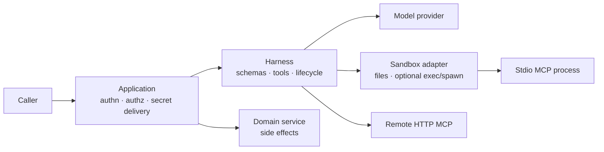

# Security Model

The Harness is designed for self-hosted applications. The application team owns
deployment, identities, authorization, data retention, and adapter selection.
The Harness supplies typed composition, validation, lifecycle management and
content-safe diagnostics; a sandbox adapter supplies the session filesystem and
any execution capability it truthfully implements.

## Security Boundary

User input, model output, tool input, tool output, retrieved content, and
external provider/MCP responses are untrusted. The application authenticates
the caller, scopes data and tenancy, chooses credentials, and makes domain
writes. A schema validates shape; it does not grant authorization.

## Sandbox Capabilities And Limits

| Adapter | Files and search | Execution | What it guarantees | What it does **not** guarantee |
| --- | --- | --- | --- | --- |
| `inMemorySandbox()` | Per-session memory filesystem; bounded in-process text search | No executor or `spawn` | No command execution through the sandbox; non-backtracking regex search | Host/process/network isolation, persistence, authorization |
| `bashSandbox()` | Per-session memory filesystem; same bounded search contract | `exec` through optional `just-bash`; no `spawn` | An in-process execution helper | Container/VM/tenant isolation or stdio MCP support |
| `localDirectorySandbox()` / local durable bundle | Jailed host-directory workspace; bounded data-local search | Host child process when `exec` is configured | Traversal and symlink-escape checks; tokenized command execution | Hardened isolation for untrusted commands or trusted plugin processes |
| `@purista/harness-sandbox-docker` | Private Docker volume; bounded search executes in the guest | Docker guest `exec` and `spawn` | Trusted local guest with non-root identity, digest-pinned image, default-deny network, and resource limits | A hostile multi-tenant boundary, durable-workspace recovery, or immutable plugin package mount |
| `@purista/harness-sandbox-kubernetes` | Run-bound PVC mounted at `/workspace`; bounded search executes in the Pod | Tokenized Pod `exec`; no host shell interpolation | Runtime-id-isolated control records, stale-generation fencing, restricted Pod spec, optional PVC/VolumeSnapshot recovery | Cluster RBAC/admission/egress/quota/CSI/image/secret policy supplied or proven automatically |
| Custom container, microVM, or remote adapter | Adapter-defined; advertise `sandbox.text_search` only when enforced | Adapter-defined, including `spawn` if declared | Only the controls the adapter/platform enforces | Controls that are merely documented but not enforced/tested |

Use `inMemorySandbox()` for file-only agents. Treat `bashSandbox()` and local
host execution as trusted-development or carefully controlled worker choices,
not a production isolation boundary. A production command/stdio adapter must
enforce and test the chosen filesystem mounts, unprivileged process identity,
network egress policy, CPU/memory/PID/disk limits, image provenance,
per-run/tenant workspace lifecycle, cancellation, and cleanup.

The Kubernetes adapter supplies the first-party self-hosted implementation,
but the platform must still enforce and test its namespaced RBAC, restricted
admission, default-deny egress, node/runtime PID policy, quota/limits, reviewed
image, CSI snapshot, encryption/retention, and orphan cleanup. Its ready
VolumeSnapshot is the committed file recovery point; no S3 service is required.

`mcp_stdio` requires a spawn-capable sandbox. `mcp_http` does not start a local
process, but the remote MCP server must independently authenticate and
authorize each request. Trusted Agent Plugin stdio servers additionally need a
sandbox that can enforce an immutable `mountReadOnly(...)` package mount;
neither the in-memory nor local host-directory built-in supplies that guarantee.

## Threats And Ownership

| Threat | Harness contribution | Required application/platform control |
| --- | --- | --- |
| Prompt injection and unsafe tool request | Explicit tool lists, schemas, permissions and governance hooks | Domain authorization, approval workflow, and an allowlist of model-reachable capabilities |
| Harmful skill instructions or scripts | Trusted-root discovery gating, explicit skill binding, inert file mounting, and no built-ins by default | Pin/review the skill source, ignore `allowed-tools` as authority, authorize tool effects, and isolate any explicitly enabled execution |
| Host/other-tenant file exposure | Per-session sandbox API; local path-jail checks | Authorize/stage data, isolate workspace roots, retention and secure cleanup |
| Arbitrary execution, egress, resource exhaustion | Files-only default, cancellation and timeout propagation | Isolating runtime, default-deny egress, workload limits, unprivileged identity and monitored quotas |
| Secrets or sensitive diagnostics | Content-free core telemetry and normalized errors | Scoped secret injection, redacting exporter/logger, production content-capture policy |
| MCP overreach | Schema validation and normalized transport errors | Remote MCP authentication/authorization; reviewed, pinned stdio package/image and process isolation |

Session IDs and schemas are useful controls, but neither establishes tenant
isolation nor authorizes an action on its own.

## Tool And Governance Risk

Built-in `bash`, `write`, and `edit` can mutate state or execute commands.

Built-in `grep` is read-only and does not require a shell, but search remains a
resource boundary. Harness uses a versioned non-backtracking regex language,
fixed file/result/byte limits, cancellation, and explicit completeness. A
custom adapter must execute the same bounded contract where its data lives and
must not log patterns, paths, or matching text.

- Built-ins are disabled by default; enable only an explicit canonical-name allowlist.
- A skill-backed agent normally needs only `builtinTools: ['read']`.
- Bind only explicit TypeScript/MCP tools to an agent; validate input and output.
- Use permission policies and `.governance(...)` for tool decisions that depend
  on typed domain facts.
- Keep business mutations behind application authorization, an idempotent
  transaction boundary, and an application-owned durable review task where
  human review is required.

When upgrading an application that previously relied on an omitted
`builtinTools` field to expose all built-ins, add an explicit, minimal
allowlist to each affected agent. `builtinTools: false` remains supported, but
omission already expresses the secure default.

Declaring a skill does not grant tools. Registration and mounting do not run
skill scripts, but `SKILL.md` and supporting files remain model-readable
instruction content. A separately allowed `bash`, custom tool, MCP server, or
custom handler can make script execution possible. Frontmatter
`allowed-tools` is not enforced and must never be treated as a permission.

Harness governance makes a bounded immediate tool decision. Static permission
and policy approval demands use one provider. The application owns durable
review identity, UI, decision storage, expiry, action binding, and execution
claim/receipt state. Check authorization before a new claim; an existing claim
must recover the same idempotent execution rather than reauthorize away a
possibly completed effect. See [decisions and approval](../guides/decisions-and-approval.md).

The optional `@purista/harness-policy-opa` client accepts only a fixed
composition-root HTTP(S) base URL, rejects credential-bearing URLs and
redirects, validates/encodes decision-path segments, bounds the response while
streaming, forwards the Harness signal/deadline, and emits content-free errors.
When used through `opaPolicy(...)`, it inherits the active Harness trace and
forwards only W3C `traceparent` to its fixed trusted endpoint; it does not copy
arbitrary request headers or policy data into telemetry. Policy evaluation
spans and decision metrics are likewise content-free.
Do not derive its URL, headers, or path from model/tool input. Use workload
identity or protected credentials, restrict egress, minimize the explicit OPA
input, and configure OPA decision-log masking and retention. OPA results do not
replace application-authenticated principal/resource resolution.

Content rails are separate from authorization. Their transforms cannot grant
authority, inspect opaque provider reasoning, undo a prior effect, or revoke
an already admitted operation. Direct model calls and custom handlers do not
receive automatic rail coverage. Log only safe decision evidence, never the
transient approval subject or raw callback exception.

## Secrets And Telemetry Privacy

- Use a secret manager or deployment-managed environment configuration.
- Do not put secrets in prompts, skills, mounted files, fixtures, tool results,
  or logs.
- Core spans and persisted events avoid prompt, model-output, file, memory and
  tool-payload content. Keep `contentCaptureMode: 'NO_CONTENT'` in production.
- Treat log/trace exporters, collectors, retention and access control as part
  of the security boundary. An adapter must not add raw content to its own
  diagnostics.

## Verification Baseline

For a custom sandbox, run `sandboxContract(...)` from
`@purista/harness/testing`; also run `sandboxTextSearchContract(...)` when the
adapter advertises `sandbox.text_search`, and add the snapshot contract only
when snapshot/resume is truly supported. Then add platform integration tests for controls generic
contracts cannot prove: blocked egress, forbidden command, cross-tenant mount,
expired credential, resource limit, cancellation/process cleanup, immutable
plugin package, and workspace retention cleanup.

The canonical developer implementation guide is the official PURISTA website:
[/handbook/harness/secure-and-govern/sandbox-and-mcp/](https://purista.dev/handbook/harness/secure-and-govern/sandbox-and-mcp/).
