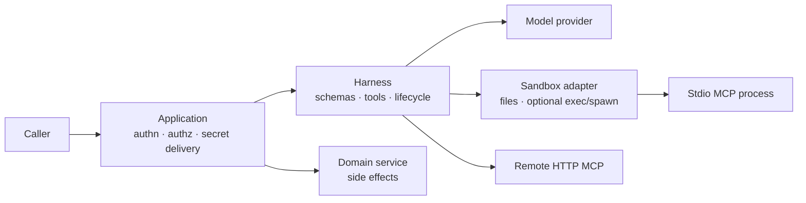

# Security Model

The Harness is designed for self-hosted applications. The application team owns
deployment, identities, authorization, data retention, and adapter selection.
The Harness supplies typed composition, validation, lifecycle management and
content-safe diagnostics; a sandbox adapter supplies the session filesystem and
any execution capability it truthfully implements.

## Security Boundary

User input, model output, tool input, tool output, retrieved content, and
external provider/MCP responses are untrusted. The application authenticates
the caller, scopes data and tenancy, chooses credentials, and makes domain
writes. A schema validates shape; it does not grant authorization.

## Sandbox Capabilities And Limits

| Adapter | Files | Execution | What it guarantees | What it does **not** guarantee |
| --- | --- | --- | --- | --- |
| `inMemorySandbox()` | Per-session memory filesystem | No executor or `spawn` | No command execution through the sandbox | Host/process/network isolation, persistence, authorization |
| `bashSandbox()` | Per-session memory filesystem | `exec` through optional `just-bash`; no `spawn` | An in-process execution helper | Container/VM/tenant isolation or stdio MCP support |
| `localDirectorySandbox()` / local durable bundle | Host-directory workspace; files-only by default | Host child process when `exec` is configured | Traversal and symlink-escape checks; tokenized command execution | Hardened isolation for untrusted commands or trusted plugin processes |
| Custom container, microVM, or remote adapter | Adapter-defined | Adapter-defined, including `spawn` if declared | Only the controls the adapter/platform enforces | Controls that are merely documented but not enforced/tested |

Use `inMemorySandbox()` for file-only agents. Treat `bashSandbox()` and local
host execution as trusted-development or carefully controlled worker choices,
not a production isolation boundary. A production command/stdio adapter must
enforce and test the chosen filesystem mounts, unprivileged process identity,
network egress policy, CPU/memory/PID/disk limits, image provenance,
per-run/tenant workspace lifecycle, cancellation, and cleanup.

`mcp_stdio` requires a spawn-capable sandbox. `mcp_http` does not start a local
process, but the remote MCP server must independently authenticate and
authorize each request. Trusted Agent Plugin stdio servers additionally need a
sandbox that can enforce an immutable `mountReadOnly(...)` package mount;
neither the in-memory nor local host-directory built-in supplies that guarantee.

## Threats And Ownership

| Threat | Harness contribution | Required application/platform control |
| --- | --- | --- |
| Prompt injection and unsafe tool request | Explicit tool lists, schemas, permissions and governance hooks | Domain authorization, approval workflow, and an allowlist of model-reachable capabilities |
| Host/other-tenant file exposure | Per-session sandbox API; local path-jail checks | Authorize/stage data, isolate workspace roots, retention and secure cleanup |
| Arbitrary execution, egress, resource exhaustion | Files-only default, cancellation and timeout propagation | Isolating runtime, default-deny egress, workload limits, unprivileged identity and monitored quotas |
| Secrets or sensitive diagnostics | Content-free core telemetry and normalized errors | Scoped secret injection, redacting exporter/logger, production content-capture policy |
| MCP overreach | Schema validation and normalized transport errors | Remote MCP authentication/authorization; reviewed, pinned stdio package/image and process isolation |

Session IDs and schemas are useful controls, but neither establishes tenant
isolation nor authorizes an action on its own.

## Tool And Governance Risk

Built-in `bash`, `write`, and `edit` can mutate state or execute commands.

- Disable built-ins with `builtinTools: false` unless needed.
- A skill-backed agent normally needs only `builtinTools: ['read']`.
- Bind only explicit TypeScript/MCP tools to an agent; validate input and output.
- Use permission policies and `.governance(...)` for tool decisions that depend
  on typed domain facts.
- Keep business mutations behind application authorization, an idempotent
  transaction boundary, and an application-owned durable review task where
  human review is required.

Harness governance can make a synchronous tool decision. It is not a durable,
restart-safe human-review runtime; the application owns reviewer identity, UI,
decision storage, expiry, stale-decision rejection, and audit records.

## Secrets And Telemetry Privacy

- Use a secret manager or deployment-managed environment configuration.
- Do not put secrets in prompts, skills, mounted files, fixtures, tool results,
  or logs.
- Core spans and persisted events avoid prompt, model-output, file, memory and
  tool-payload content. Keep `contentCaptureMode: 'NO_CONTENT'` in production.
- Treat log/trace exporters, collectors, retention and access control as part
  of the security boundary. An adapter must not add raw content to its own
  diagnostics.

## Verification Baseline

For a custom sandbox, run `sandboxContract(...)` from
`@purista/harness/testing`; add the snapshot contract only when snapshot/resume
is truly supported. Then add platform integration tests for controls generic
contracts cannot prove: blocked egress, forbidden command, cross-tenant mount,
expired credential, resource limit, cancellation/process cleanup, immutable
plugin package, and workspace retention cleanup.

The canonical developer implementation guide is the official PURISTA website:
[/handbook/harness/guide/sandboxing-and-mcp/](https://purista.dev/handbook/harness/guide/sandboxing-and-mcp/).
