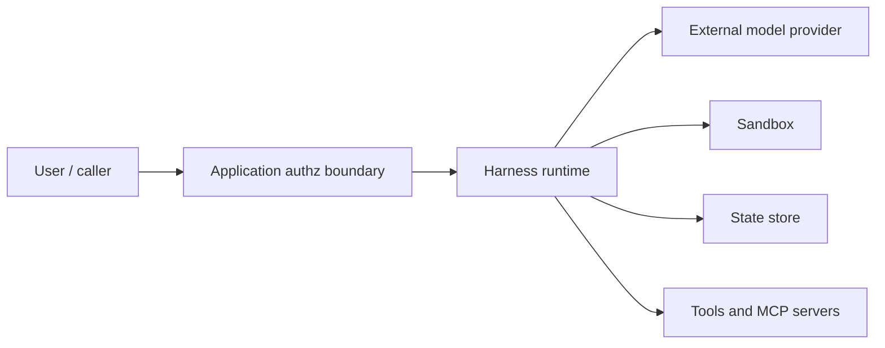

# Security Model

The harness is designed for self-hosted systems where the application team owns
deployment, adapters, data retention, and authorization.

## Trust Boundaries

| Boundary | Treat As | Required Control |
|---|---|---|
| User input | Untrusted | Validate with schemas and application authz. |
| Model output | Untrusted | Validate output schemas before use. |
| Tool input from model | Untrusted | Validate tool schemas and permission gates. |
| External providers | External dependency | Timeouts, error mapping, secret handling. |
| Sandbox execution | Privileged | Least privilege, explicit executor choice. |
| State/history | Sensitive data | Retention, tenant scoping, access control. |

## Secrets

- Use environment variables or secret managers.
- Do not put secrets in skill files, wiki pages, prompts, test fixtures, or logs.
- Do not enable telemetry content capture in shared environments.
- Redact MCP payloads and provider request bodies by default.

## Sandbox And Tool Risk

Built-in `bash`, `write`, and `edit` can mutate state or execute commands.

Recommended defaults:

- disable built-ins with `builtinTools: false` unless needed;
- for skill-backed agents, enable `builtinTools: ['read']` so skills can be
  loaded without enabling mutation or command execution;
- allow only explicit custom tools;
- for workflows, use `delegation.agents` and model alias allowlists when only
  specific child agents or review models should be reachable;
- use `inMemorySandbox()` for file-only use cases;
- use executor-capable sandbox only for trusted workloads that require command
  execution or `mcp_stdio`;
- add permission hooks for mutating tools.

## MCP Security

| Mode | Main Risk | Mitigation |
|---|---|---|
| `mcp_stdio` | Local command execution. | Run through sandbox executor; use idempotent install; restrict env; set timeouts. |
| `mcp_http` | Remote service and auth exposure. | Use HTTPS, scoped tokens, auth failure handling, and payload redaction. |

## Telemetry Privacy

Default behavior is privacy-safe:

- persisted event payload content is always redacted by core;
- spans include IDs, safe scalar metadata, and error metadata, not full prompts,
  model outputs, tool input/results, files, memory, expected outputs, or
  context content;
- provider and MCP error metadata should be actionable without leaking secrets.

`telemetry.contentCaptureMode` is accepted as a stable policy value. v1 core
does not emit prompt/tool/file/context content in any mode; memory content is
omitted by default and only follows the bounded memory-facade policy when
non-`NO_CONTENT` modes are enabled.

## Review Gates

Human-in-the-loop flows should enforce:

- no mutation before approval;
- typed review decisions;
- idempotent decision submission;
- stale review/run rejection;
- audit log entry for applied, rejected, or revision decisions.
