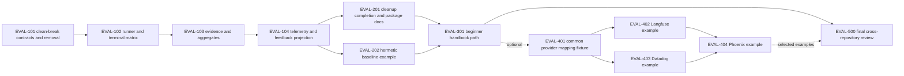

# Generic evaluation run/result implementation plan

Status: superseded delivery plan — do not dispatch these tickets unchanged.
Planning/specification only; no evaluation implementation started.

Revision: 2026-08-26. The owner's expanded method-first handbook, re-scoring,
judge-adapter and existing model/cost/optional-OTel requirements are addressed
by the [replacement revision plan](./2026-08-26-evaluation-workstream-revision-plan.md)
and [revised design direction](./2026-08-26-evaluation-methods-and-toolkit-direction.md).
The ticket details below are historical planning input only. Their lifecycle
labels do not authorize implementation under the unrevised contracts.

Date: 2026-08-25

Primary specification:
[`specs/35-generic-evaluation-runs.md`](../specs/35-generic-evaluation-runs.md)

Research inputs:

- [`2026-08-25-practical-ai-evaluation-roadmap.md`](./2026-08-25-practical-ai-evaluation-roadmap.md)
- [`2026-08-25-sandbox-and-evaluation-direction.md`](./2026-08-25-sandbox-and-evaluation-direction.md)

## Planning authority

The repository owner auto-approved this specification workstream and selected a
clean break. The previous readiness record predates the expanded requirements
and newly identified contract gaps; it is not readiness evidence for the revised
direction. REV-001 in the replacement plan must reconcile the canonical specs
and evaluation readiness record before implementation. No new owner approval
round is required, but technical verification remains required.

The present task remains planning-only: package source, tests, docs, examples,
generated API artifacts, and website content are read scope, not current write
scope. A future controller may materialize manifest-bound AFK ticket files from
this plan, but must not reintroduce compatibility, deprecation, or transition
work while doing so.

## Outcome and boundaries

The implementation sequence delivers:

1. a generic in-process evaluation matrix in `@purista/harness`;
2. stable dataset/case/candidate/task/scorer identity and multiple versioned,
   multi-dimension scorers;
3. fixed-cardinality per-case results, bounded evidence, safe errors, duration,
   usage/cost, and Harness run/trace correlation;
4. deterministic aggregates by candidate, scorer dimension, and declared
   segment;
5. bounded concurrency, retry, failure policy, cancellation, and timeouts;
6. content-free evaluation telemetry and a lossy `FeedbackRecord` projection;
7. a beginner-first public handbook path;
8. optional Langfuse, Datadog, and Phoenix examples after the core substrate.

It does not deliver dataset or experiment persistence, dataset UI, annotations,
dashboards, online sampling, hosted judges, a reporter/sink port, HTTP/CLI
surfaces, or any vendor dependency in Harness core.

## Dependency graph



## Wave 1 — generic core substrate

This is a horizontal foundation exception: a generic typed SDK boundary must be
frozen before the first vertical evaluation run can be exposed. Tickets are
serial because they touch one fragile public result surface.

### EVAL-101 — Clean-break contracts, obsolete surface removal, and validation

Depends on: none

Lifecycle: `superseded` — blocked on replacement REV-001 contract revision

Write scope:

- `ai-harness/packages/harness/src/eval/contracts.ts`
- `ai-harness/packages/harness/src/eval/validation.ts`
- `ai-harness/packages/harness/src/eval/deterministic.ts`
- `ai-harness/packages/harness/src/eval/deterministic.test.ts`
- `ai-harness/packages/harness/src/eval/index.ts`
- `ai-harness/packages/harness/src/eval/index.test.ts`
- `ai-harness/packages/harness/src/eval/contracts.test.ts`
- `ai-harness/packages/harness/src/eval/validation.test.ts`
- `ai-harness/packages/harness/src/index.ts`
- `ai-harness/packages/harness/src/testing/index.ts`
- `ai-harness/packages/harness/src/errors/catalog.ts`
- the Harness public export/type test files that currently enforce spec 13
- no `runEvaluation` export from `src/index.ts` until `EVAL-102` completes the
  vertical runner slice

Read scope:

- approved spec 35 and its public API/error anchors
- existing `eval/index.ts`, feedback types, telemetry shim, error base/catalog,
  JSON types, and type-test conventions

Test-first actions:

1. Add failing public-export and stale-symbol assertions for deletion of the
   old aggregate evaluator and standalone scorer surface, plus the new closed
   unions, deterministic scorer factory, and generic callback inference.
2. Add failing validation tests for empty definitions, duplicate/invalid IDs,
   invalid label allowlists and segments, bad concurrency/retry/timeout values,
   and malformed task/scorer results.
3. Delete the obsolete evaluator implementation and its behavior tests; retain
   only reusable private algorithms that are reshaped behind the new contracts
   and covered by new tests.
4. Implement TSDoc-ready contracts and pure validators. Keep arbitrary
   application input/output values inside callback-only generic types.
5. Implement `createDeterministicEvaluationScorer` as a normal one-dimension
   `EvaluationScorer`, including strict upfront rule validation and the
   documented JSON Pointer/JSON-schema subset.
6. Extend only the approved `ValidationError` and operation timeout/cancel scope
   unions; do not add an evaluation-specific error class.
7. Prove validation performs no callback, telemetry, or other side effect.
8. Remove old main/testing exports and add the new type and factory exports;
   the incomplete runner function remains unexported until EVAL-102.

Prohibited:

- Zod or another runtime dependency solely for these internal validators;
- `any`, unchecked result casts, open string status fields, vendor types,
  persistence DTOs, or a reporter/sink port;
- exporting a partial `runEvaluation` API;
- aliases, forwarding exports, wrappers, overloads, feature flags, duplicate
  old callback shapes, or tests that preserve old behavior.

Acceptance:

- all spec 35 contract fields and exact enum values have strict TypeScript
  representation;
- validation error issues identify the invalid field without copying candidate
  config, case content, output, or evidence;
- public types have IDE-friendly TSDoc and a concise non-obvious usage example;
- repository and declaration searches contain none of the removed symbols
  outside the approved removal lists in the specification and this plan;
- no compatibility or deprecation surface remains in source or exports.

Verification:

```text
cd ai-harness
npm run typecheck --workspace @purista/harness
npm run test --workspace @purista/harness -- src/eval/contracts.test.ts src/eval/validation.test.ts src/eval/deterministic.test.ts
npm run test:types --workspace @purista/harness
```

### EVAL-102 — Bounded runner, retry, cancellation, timeout, and terminal matrix

Depends on: `EVAL-101`

Lifecycle: `planned`

Write scope:

- `ai-harness/packages/harness/src/eval/runner.ts`
- `ai-harness/packages/harness/src/eval/runner.test.ts`
- private evaluation abort/clock helpers under
  `ai-harness/packages/harness/src/eval/`
- `ai-harness/packages/harness/src/eval/index.ts`
- `ai-harness/packages/harness/src/index.ts`
- Harness public export/type tests

Read scope:

- EVAL-101 contracts/validators
- existing runtime abort helpers, `HarnessError`, telemetry shim, and the new
  clean-break contract/export tests

Test-first actions:

1. Add a deferred-promise concurrency fixture that fails if active cells exceed
   `maxConcurrency` and records claimed ordinals.
2. Add happy-path tests for task-before-scorer order, sequential scorer order,
   callback target identities, copied segment maps, raw-output lifetime, and
   fixed result matrix.
3. Add terminal-path tests for task/scorer errors under both failure policies,
   retry predicate/default behavior, abortable fixed delay, external pre/mid-run
   cancellation, run/task/scorer timeout, and callbacks that ignore the signal.
4. Implement ascending-ordinal worker claims and per-cell sequential attempts.
5. Resolve terminal results after scheduling starts; reject only definition
   validation. Attach rejection handlers to timeout-raced callbacks.
6. Export `runEvaluation` and its contracts only after all runner behavior
   passes.
7. Run stale-symbol tests to prove the removed evaluator cannot be imported and
   no old callback/result shape was recreated while implementing the runner.

Prohibited:

- `Promise.all` over the full matrix;
- nested scorer parallelism;
- callback completion order as result order;
- persistence, global mutable registry, hidden provider retry, background work
  after shutdown that can produce unhandled rejection, or force-kill claims;
- restoring the removed evaluator through a wrapper, internal mirror, or
  alternate export.

Acceptance:

- active task cells never exceed the configured finite bound;
- result contains every candidate/case and scorer placeholder in canonical
  order for all terminal statuses;
- cancellation/timeout signals reach callbacks and no new callback starts after
  the stop boundary;
- run status precedence matches spec 35;
- candidate config, case content, and raw task output do not appear in results.

Verification:

```text
cd ai-harness
npm run test --workspace @purista/harness -- src/eval/runner.test.ts test/public-api.test.ts
npm run typecheck --workspace @purista/harness
npm run test:types --workspace @purista/harness
```

### EVAL-103 — Evidence normalization, errors, aggregates, and segmentation

Depends on: `EVAL-102`

Lifecycle: `planned`

Write scope:

- `ai-harness/packages/harness/src/eval/evidence.ts`
- `ai-harness/packages/harness/src/eval/errors.ts`
- `ai-harness/packages/harness/src/eval/aggregates.ts`
- matching tests under `ai-harness/packages/harness/src/eval/`
- `runner.ts` only for calling the approved pure helpers

Read scope:

- approved result/aggregate contracts, Harness error/redaction conventions, and
  runner terminal records

Test-first actions:

1. Add exact 4,096/4,097-byte evidence tests, discarded-content scans, and
   invalid reference tests.
2. Add Harness/non-Harness error fixtures containing secrets in message, stack,
   cause, provider body, headers, and metadata; assert none enter results.
3. Add table-driven aggregate tests for nearest-rank p50/p95, means, explicit
   pass rates, label zero counts/order, status counts, missing segments, absent
   distributions, task-plus-scorer token sums, multi-currency costs, and no
   failed-attempt usage estimation.
4. Add randomized callback completion with fixed clocks and compare serialized
   result bytes across repeated runs.
5. Add table-driven result-field invariant tests for every scorer and case
   terminal status, including started and unstarted cancellation/timeout.
6. Implement pure normalization and aggregation with no callback or telemetry
   dependency.

Prohibited:

- partial JSON truncation, implicit pass inference, score normalization,
  confidence/significance claims, currency conversion, token estimation,
  cross-segment combinations, or one composite release score;
- error messages, stacks, causes, or arbitrary metadata in canonical results.

Acceptance:

- all result values are finite/valid and ordered exactly as spec 35;
- aggregate input is terminal records only;
- oversize evidence is unreachable after normalization;
- error and privacy scans pass with adversarial fixtures.

Verification:

```text
cd ai-harness
npm run test --workspace @purista/harness -- src/eval/evidence.test.ts src/eval/errors.test.ts src/eval/aggregates.test.ts
npm run test:coverage --workspace @purista/harness
npm run typecheck --workspace @purista/harness
```

### EVAL-104 — Evaluation telemetry and FeedbackRecord projection

Depends on: `EVAL-103`

Lifecycle: `planned`

Write scope:

- `ai-harness/packages/harness/src/eval/telemetry.ts`
- `ai-harness/packages/harness/src/eval/feedback.ts`
- `ai-harness/packages/harness/src/telemetry/flavor.ts`
- `ai-harness/packages/harness/src/sessions/index.ts` only to replace its
  private telemetry-flavor wrapper with the shared telemetry helper
- matching evaluation tests
- `ai-harness/packages/harness/src/eval/runner.ts` for telemetry calls only
- `ai-harness/packages/harness/src/eval/index.ts`
- `ai-harness/packages/harness/src/index.ts`
- `ai-harness/packages/harness/src/testing/index.ts` only if the approved API
  requires a testing re-export
- telemetry integration tests and public export/type tests

Read scope:

- telemetry shim/flavor filter, `RecordingTelemetry`, `FeedbackRecord`,
  `FeedbackTarget`, and specs 13/14/34

Test-first actions:

1. Add failing recording-telemetry tests for exact run/case/scorer spans,
   metrics, attributes, status, error type, and OpenInference flavor behavior.
2. Run the same secret-rich fixture under all four content capture modes and
   assert identical absence of content and high-cardinality identities.
3. Assert the removed `harness.eval.candidate` span and candidate-score metric
   never appear.
4. Add feedback projection tests for numeric, boolean, and label dimensions,
   deterministic IDs/order, undefined targets, and the full exclusion list.
5. Implement telemetry through the existing shim and projection through the
   existing feedback contracts. Do not mutate `FeedbackRecord` or add an
   evaluation target kind.
6. Move the existing session-local telemetry flavor filter into
   `telemetry/flavor.ts`, preserve session behavior with unchanged tests, and
   reuse that one helper for evaluation spans. Do not create a second flavor
   implementation.

Prohibited:

- score/candidate/case/dataset/run IDs or segments on metrics;
- raw correlation IDs as attributes, exception messages, evidence, output refs,
  usage/cost, or feedback content in telemetry;
- feedback persistence or reconstructing evaluation results from feedback.

Acceptance:

- spec 14's exact evaluation catalog is emitted at least once in integration
  tests and contains no undeclared attribute;
- telemetry failure does not change evaluation outcome;
- feedback projection is deterministic, content-free, and explicitly lossy;
- no new vendor or OTel SDK/exporter dependency enters core.

Verification:

```text
cd ai-harness
npm run test --workspace @purista/harness -- src/eval/telemetry.test.ts src/eval/feedback.test.ts
npm run test:integration
npm run test:types
npm run verify:architecture
```

## Wave 2 — cleanup completion and first runnable baseline

### EVAL-201 — Cleanup completion and package-local documentation alignment

Depends on: `EVAL-104`

Lifecycle: `planned`

Write scope:

- `ai-harness/docs/guides/testing.md`
- `ai-harness/docs/guides/evaluating-prompts.md`
- `ai-harness/docs/reference/public-api.md`
- `ai-harness/docs/README.md`
- `ai-harness/packages/harness/README.md`

Read scope:

- implemented public exports, specs 13/14/19/34, and current documentation
  navigation

Actions:

1. Delete every obsolete evaluator and standalone-scorer example, API row,
   guide paragraph, navigation claim, and testing recommendation.
2. Add the deterministic scorer factory only as a normal generic scorer; do not
   document a standalone target/result path.
3. Add the generic runner's identity, result, failure, privacy, and aggregation
   contract with a small TypeScript example whose output matches a tested
   fixture.
4. Document that content capture modes never enable evaluation content and
   that provider platforms own retention/access policy.
5. Remove the old claim that candidate telemetry is emitted.

Acceptance:

- every code sample typechecks against workspace packages;
- no page presents Harness as a dataset/experiment/annotation/dashboard
  product;
- repository-wide docs/package scans find none of the removed functions or
  types outside explicit removal requirements in specs and this plan;
- no compatibility, deprecation, transition, or dual-API guidance is shipped.

Verification:

```text
cd ai-harness
npm run typecheck
npm run build
rg -n "evaluatePromptCandidates|evaluateDeterministicScorer|PromptCandidate|EvaluationItem|CandidateScore|EvaluatePromptCandidatesInput|DeterministicScorerDefinition|ScorerTarget|ScorerResult|harness\.eval\.candidate([^.]|$)|harness\.eval\.candidate\.score" docs packages/harness/README.md packages/harness/src
```

The command must return no matches in implementation or public documentation;
the specification and approved plan are excluded deliberately.

### EVAL-202 — Hermetic “evaluation in one hour” baseline example

Depends on: `EVAL-104`

Lifecycle: `planned`

Write scope:

- `ai-harness/examples/evaluation-baseline/**`
- `ai-harness/package-lock.json` only for workspace registration changes
- `ai-harness/docs/guides/README.md` for one example link

Read scope:

- implemented generic API, fake model/testing utilities, and example package
  conventions

Actions:

1. Create a private TypeScript workspace with 20 synthetic support-policy cases
   split across at least two declared segments.
2. Define a frozen baseline and one candidate, one deterministic hard gate, and
   one deterministic quality dimension; no live model or LLM judge.
3. Return synthetic run/trace correlation and token counts. Include two
   synthetic currencies to demonstrate that core groups them without conversion;
   keep all values non-sensitive.
4. Assert per-case failure inspection, segment aggregates, separate
   latency/cost output, deterministic ordering, and a conservative CI decision
   outside core.
5. Assert emitted telemetry contains no cases, prompts, output, evidence, or
   candidate identities.

Acceptance:

- example test is hermetic and output snapshot is deterministic under a fake
  clock;
- the README answers the seven beginner decisions from the research roadmap;
- release logic keeps hard gates, quality, latency, and cost separate;
- no vendor import or credential exists.

Verification:

```text
cd ai-harness
npm run lint --workspace @purista/evaluation-baseline
npm run build --workspace @purista/evaluation-baseline
npm run test --workspace @purista/evaluation-baseline
```

## Wave 3 — canonical beginner handbook path

### EVAL-301 — Public Harness evaluation learning path

Depends on: `EVAL-201`, `EVAL-202`

Lifecycle: `planned`

Write scope:

- `purista/web/src/content/handbook/harness/test-and-evaluate/index.md`
- `purista/web/src/content/handbook/harness/test-and-evaluate/evaluation-in-one-hour.md`
- `purista/web/src/content/handbook/harness/test-and-evaluate/evaluate-prompts-and-outputs.md`
- `purista/web/src/content/handbook/harness/test-and-evaluate/evaluation-datasets-and-ci.md`
- `purista/web/src/content/handbook/harness/test-and-evaluate/diagnose-regressions.md`
- `purista/web/src/data/handbook.ts`
- generated `purista/web/src/data/handbook-content-manifest.ts` only through the
  repository's documented generator/audit flow
- handbook coverage and navigation artifacts owned by the active handbook
  refactor plan; obsolete evaluation pages are deleted rather than redirected
  to a second API path

Read scope:

- approved handbook information architecture and refactor plan
- implemented baseline example and package-local docs
- current Harness public API and telemetry specs

Actions:

1. Make “Evaluation in one hour” the first evaluation page after deterministic
   test guidance. Reuse the maintained example rather than duplicating an
   untested implementation.
2. Teach behavior, cases, hard gates, quality dimensions, baseline, threshold,
   and production-feedback decisions before scorer taxonomy.
3. Show per-case inspection, segment comparison, separate safety/quality/
   latency/cost decisions, cancellation/timeouts/failures, and privacy-safe
   result handling.
4. Add dataset/CI and diagnosis pages with representative, difficult,
   failure-derived, holdout, and adversarial case guidance; do not add storage
   or UI claims to core.
5. Keep prompt/output evaluation as the first focused use case. Reserve RAG,
   tool trajectory, workflow, and guardrail pages for later helper waves.
6. Update the canonical manifest/coverage mapping and preserve old routes
   through the handbook refactor's redirect rules.

Acceptance:

- a beginner can run the maintained example and interpret one regression
  without selecting a vendor;
- each page contains release question, minimum dataset, hard versus quality/
  operational measures, runnable evidence, failure segmentation, CI policy,
  production feedback, privacy/cost warnings, and next step;
- Framework and Harness navigation remain separate and all audits pass.

Verification:

```text
cd purista
npm run audit:skills
npm run audit:knowledge
npm run audit:api-docs
npm run build:doc
```

## Wave 4 — optional provider examples

Provider tickets remain optional and serially follow the generic substrate and
beginner path. Vendor imports stay inside their private example workspace.
Every ticket must pin current stable package versions from official
documentation/package metadata during its own readiness update; no core lock or
dependency changes are allowed.

Official integration evidence checked on 2026-08-25:

- [Langfuse experiments via the JS/TS SDK](https://langfuse.com/docs/evaluation/experiments/experiments-via-sdk)
  and [server/SDK compatibility](https://langfuse.com/docs/compatibility)
- [Datadog external evaluations](https://docs.datadoghq.com/llm_observability/evaluations/external_evaluations/),
  [Node.js Agent Observability SDK](https://docs.datadoghq.com/llm_observability/instrumentation/sdk/?tab=nodejs),
  and [experiment setup](https://docs.datadoghq.com/llm_observability/experiments/setup/)
- [Phoenix TypeScript SDK packages](https://arize.com/docs/phoenix/resources/typescript-api)
  and [experiment execution](https://arize.com/docs/phoenix/datasets-and-experiments/how-to-experiments/run-experiments)

### EVAL-401 — Common provider mapping fixture

Depends on: `EVAL-301`

Lifecycle: `planned`

Release selection: optional; required only when one or more vendor examples are
selected

Write scope:

- `ai-harness/examples/evaluation-provider-mapping/**`

Actions:

1. Create a vendor-free mapping fixture containing a safe `EvaluationRunResult`
   with numeric, boolean, and label dimensions plus run/trace correlation.
2. Define mapping assertions for task/candidate, versioned dataset case and
   segments, per-case score/evidence, and run/trace correlation.
3. Define a shared redaction assertion that rejects raw case input, expected
   value, context, output, prompt, evidence value, secrets, and headers in
   provider payload snapshots.
4. Keep this example private and test-only; it is not a reporter/sink contract.

Acceptance:

- all provider examples can consume the same fixture without importing each
  other;
- no provider-shaped type enters Harness core;
- the fixture is synthetic and content-safe.

### EVAL-402 — Optional Langfuse dataset/experiment example

Depends on: `EVAL-401`

Lifecycle: `planned`

Release selection: optional

Write scope:

- `ai-harness/examples/evaluation-langfuse/**`
- root workspace lockfile entries required by this private workspace only

Current official integration anchors:

- `@langfuse/client` experiment runner/datasets;
- `@langfuse/otel` OpenTelemetry span processor;
- Langfuse JS/TS SDK v5 compatibility, with experiment support verified against
  the current server major before pinning.

Actions:

1. Map a local Harness dataset/task/result into Langfuse dataset items,
   experiment items, score types, and trace correlation without changing the
   Harness runner.
2. Keep raw content export disabled in the default example. Add an explicit,
   isolated opt-in sanitizer for users who choose to export dataset content.
3. Test mapping and shutdown/flush with local fakes. Put live dataset creation
   and experiment submission behind explicit environment variables.
4. Document server/SDK compatibility, data leaving the process, hosting region,
   retention, access control, and self-hosting ownership.

Acceptance:

- local tests need no network or credentials;
- live tests are opt-in and flush telemetry deterministically;
- multiple score kinds and per-case trace mapping are preserved;
- no Langfuse package appears in a Harness core package manifest.

### EVAL-403 — Optional Datadog external-evaluation example

Depends on: `EVAL-401`

Lifecycle: `planned`

Release selection: optional

Write scope:

- `ai-harness/examples/evaluation-datadog/**`
- root workspace lockfile entries required by this private workspace only

Current official integration anchors:

- Node.js `dd-trace` Agent Observability SDK for trace instrumentation and
  external evaluation submission;
- external evaluation score/categorical/boolean mapping;
- OTel trace/span hexadecimal-to-decimal conversion when using the evaluation
  HTTP API with `source:otel`;
- Datadog Experiments are currently Python-first, so the TypeScript example must
  not claim a Node experiment runner that official docs do not provide.

Actions:

1. Export Harness OTel spans to Datadog through application-owned setup and map
   completed dimension results to external evaluations.
2. Preserve assessment separately from numeric/categorical/boolean value and
   omit reasoning/evidence by default.
3. Add local SDK/API payload fakes and an explicit opt-in live submission test.
4. Document site support, Agent versus agentless correlation, API/application
   keys, data sent, Datadog retention/access policy, and the TypeScript/Python
   experiment boundary.

Acceptance:

- trace/span correlation conversion is covered by known-value tests;
- no input/output/evidence/error content enters the default Datadog payload;
- unsupported Node experiment behavior is not simulated or claimed;
- no Datadog package appears in Harness core.

### EVAL-404 — Optional Phoenix OpenInference experiment example

Depends on: `EVAL-402`, `EVAL-403`

Lifecycle: `planned`

Release selection: optional

Write scope:

- `ai-harness/examples/evaluation-phoenix/**`
- root workspace lockfile entries required by this private workspace only

Current official integration anchors:

- `@arizeai/phoenix-client` datasets and experiments;
- `@arizeai/phoenix-otel` trace export;
- optional `@arizeai/phoenix-evals` only if the example deliberately compares a
  Phoenix evaluator with the Harness scorer boundary.

Actions:

1. Map the common fixture to Phoenix examples, experiment task/evaluators, and
   OpenInference/OTel correlation.
2. Keep Harness as the executor/result source; do not run the same task twice
   through nested experiment runners unless the page explicitly compares those
   alternatives.
3. Default to a local/self-hosted Phoenix configuration example with no raw
   content export. Put live server tests behind explicit environment variables.
4. Document which package owns datasets, experiments, evaluator execution,
   trace export, retention, and access control.

Acceptance:

- mapping tests are hermetic and compatible with a local Phoenix endpoint;
- score/evidence loss is explicit and tested;
- no Phoenix package appears in Harness core;
- docs do not imply that OpenInference annotations are Harness persistence.

## Wave 5 — final review

### EVAL-500 — Cross-repository acceptance and drift review

Depends on: all implemented required tickets; optional provider tickets only
when selected for release

Lifecycle: `planned`

Write scope:

- review findings under `ai-harness/plans/`
- ticket/status evidence generated when the later implementation task begins
- no source changes unless routed through a remediation ticket

Review matrix:

1. Trace every spec 35 acceptance requirement to a unit, type, integration,
   failure, example, documentation, or privacy test.
2. Compare public exports with spec 13, all emitted instruments/attributes with
   spec 14, operation scopes with spec 15, and required gates with spec 16.
3. Verify complete removal of the old evaluator/scorer surface and exercise the
   deterministic factory only through the generic scorer contract.
4. Scan core manifests/imports for Langfuse, Datadog, Phoenix, dataset store,
   dashboard, annotation, and hosted-judge coupling.
5. Run content-leak fixtures across results, feedback, logs, metrics, spans,
   snapshots, and provider-mapping payloads.
6. Verify the beginner path against the maintained baseline example and the
   canonical handbook IA.

Required commands:

```text
cd ai-harness
npm run lint
npm run typecheck
npm run build
npm test
npm run test:coverage
npm run test:types
npm run test:contracts
npm run test:integration
npm run test:failure
npm run verify:architecture

cd ../purista
npm run audit:skills
npm run audit:knowledge
npm run audit:api-docs
npm run build:doc
```

Final acceptance requires independent implementation review against the
approved specification and ticket scope. Passing tests alone cannot justify a
new public semantic choice or privacy-policy change.

## Explicit follow-ups outside this plan

- trajectory projection/comparison helpers;
- retrieval ranking and evidence-aware RAG helpers;
- workflow invariant scorers;
- guardrail confusion-matrix summaries;
- frozen-baseline regression comparison helpers;
- any generic `EvaluationSink`/`EvaluationReporter` port;
- production sampling, human annotation, judge hosting, dashboards, and dataset
  lifecycle products.

Each follow-up starts from evidence produced by the generic substrate and needs
its own approved behavior and package-boundary decision.
