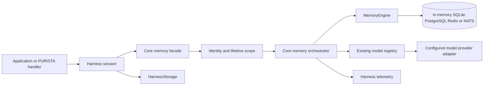

# Architecture overview

## Runtime flow

`HarnessStorage`, memory, and model providers remain sibling ports. Core memory orchestration is final composition around `MemoryEngine`; a vendor engine cannot replace scoping, validation, model routing, content-capture policy, search fusion, telemetry, or error normalization.

## Operation order

### Read, list, and delete

1. Bind the session identity and requested lifetime scope.
2. Validate key, filters, capability, limit, cursor, and cancellation.
3. Open `harness.memory.<operation>`.
4. Invoke the engine with the canonical scope key.
5. Normalize result and engine error.

### Indexed write

1. Validate JSON, TTL, tags, metadata, index text, scope, and engine capability.
2. Derive index text: the string value by default, explicit `index.text` for structured JSON, or no index text.
3. Start `harness.memory.set`.
4. When semantic indexing is enabled, call the existing embedding model handle as a nested model span.
5. Validate finite vector values and configured or persisted dimensions.
6. Ask the engine to atomically write the value, text index, vector, and index descriptor.
7. Emit operation metrics. Token and cost data remain owned by the nested model span.

### Search

1. Validate query and scope.
2. Resolve the effective mode from explicit query mode or effective capabilities.
3. For semantic or hybrid mode, create the query embedding through the model registry.
4. Execute engine text/vector search with tenant and principal constraints inside the query.
5. Use engine-native hybrid search or core reciprocal-rank fusion.
6. Return one normalized, deduplicated result list.

### Summary refresh

1. Count complete turns after the successful run commit.
2. On the configured interval, read the bounded source window from `HarnessStorage`.
3. Call the configured object-capable model with the core summary schema.
4. Store the summary plus source message ids, source digest, generated timestamp, alias, model id, and revision through memory.
5. Emit success or failure diagnostics. The durable conversation is never replaced, truncated, or hidden by summary refresh.

## Identity and lifetime

`HarnessIdentity` contains independent optional `tenantId` and `principalId`. Absence is meaningful and no sentinel default id is persisted.

| tenantId | principalId | Meaning |
| --- | --- | --- |
| absent | absent | application or single-user deployment |
| absent | present | principal-only deployment |
| present | absent | tenant-only deployment |
| present | present | principal qualified by tenant |

Lifetime scope is separate:

- `application`: one application-wide namespace.
- `tenant`: requires tenant identity.
- `principal`: requires principal identity and includes tenant identity when present.
- `session`: includes session id and bound identity.
- `run`: includes run id, session id, and bound identity.
- `agent`: includes agent id and the most specific bound identity.

`harness.getSession(id, identity?)` binds the identity on first creation. Reopening the same session id with a different identity or omitting a previously bound dimension fails before sandbox, model, memory, or run work. This prevents accidental cross-boundary reuse; application authorization remains outside Harness.

## Atomicity and distributed behavior

- The core performs no post-ranking tenant filter.
- A write with index text is one logical write. Engine contracts require atomic record/index visibility.
- First-vector dimension initialization uses engine compare-and-set semantics. Concurrent mismatches yield `index_descriptor_conflict`.
- PostgreSQL uses one transaction and database constraints.
- Redis uses one Lua script or transaction whose contract tests prove no partially visible record/index state.
- SQLite uses one local transaction. FTS5 and optional sqlite-vec rows become visible with the canonical record or not at all.
- NATS stores one canonical record per key and uses KV revision compare-and-set for conflicting writes. Because it has no secondary relevance index, no cross-record index transaction is required.
- In-memory uses one process-local lock and advertises no persistence or multi-instance capability.
- Core creates no retry queue, reindex worker, scheduler, or distributed lock service.

## Engine selection and package ownership

| Need | Engine | Boundary |
| --- | --- | --- |
| tests or ephemeral local execution | default in-memory | core package, zero configuration |
| local durable single-host memory | SQLite | optional Harness package; built-in runtime SQLite |
| local durable exact vector search | SQLite plus `sqlite-vec` | explicit `vector: true`; optional native peer |
| distributed relational/search workload | PostgreSQL plus pgvector | optional Harness package; production database |
| distributed low-latency indexed workload | Redis Search | optional Harness package; production database |
| distributed KV recall on an existing NATS estate | NATS JetStream KV | optional Harness package; no relevance search |

The engine packages belong to the AI Harness repository. PURISTA StateStore adapters remain general framework components and are not wrapped, inherited, or imported. Reusing a vendor means reusing its official client and proven lifecycle conventions, not conflating two contracts.

## Failure edges

- Wrong model capability: compile-time rejection and runtime validation.
- Provider method absent: build failure before a memory operation.
- Embedding request fails: indexed write/search fails before engine mutation.
- Index fingerprint or dimension differs: operation fails with reindex remediation; no silent new index and no semantic downgrade.
- Text/vector capability missing for explicit search mode: operation fails before model or engine I/O.
- `sqlite-vec` missing or native extension loading unsupported while `vector: true`: Harness build fails with the package/version or runtime remediation; text-only execution does not start silently.
- SQLite FTS5 unavailable: readiness fails because the engine cannot truthfully advertise text search.
- NATS receives a relevance-search request: capability validation fails before NATS I/O. Enumeration remains bounded but is O(namespace keys), so it is not an analytics backend.
- Summary refresh fails: completed run remains completed; visible diagnostics record the failed enrichment.
- Cancellation: abort propagates through model and engine; no later write occurs.
