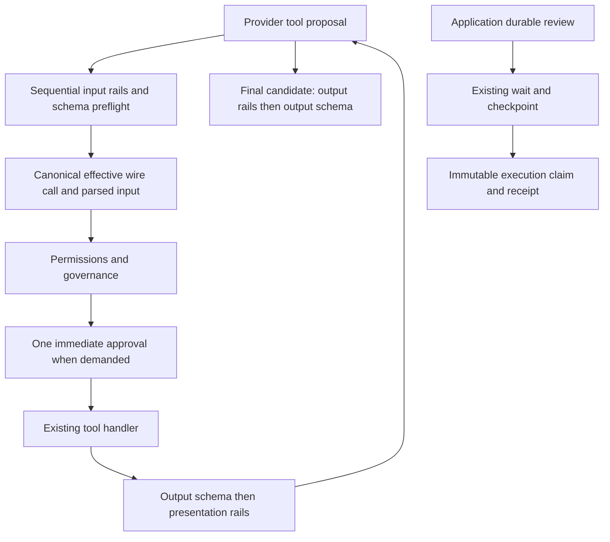

# Decision boundary architecture

Content guardrails inspect/transform content; permissions/governance authorize an effective tool occurrence; immediate approval resolves one bounded demand; durable review suspends through existing wait/checkpoint APIs and application-owned execution admission. An allow is local to its boundary and cannot override another boundary's deny. A transform cannot grant authority. No guardrail approval effect is added.

Shared core decisions owns validated evidence, identity and bounded callbacks, not policy DSL or persistence. Governance owns reduction, approval and audit. Private tool-execution owns prepared batches and deadlines. Provider adapters own opaque continuation mapping. Addon retains rail compilation/actions. Review store stays in its example. See module/reuse/representation catalogs for authoritative owners and allowed imports.

Concurrency: preflight all proposed calls before any side effect, then existing bounded execution. Cancellation fences late results but cannot undo noncooperative external effects. Review idempotency supplies domain certainty, not a callback timeout. No new distributed subsystem is introduced.
