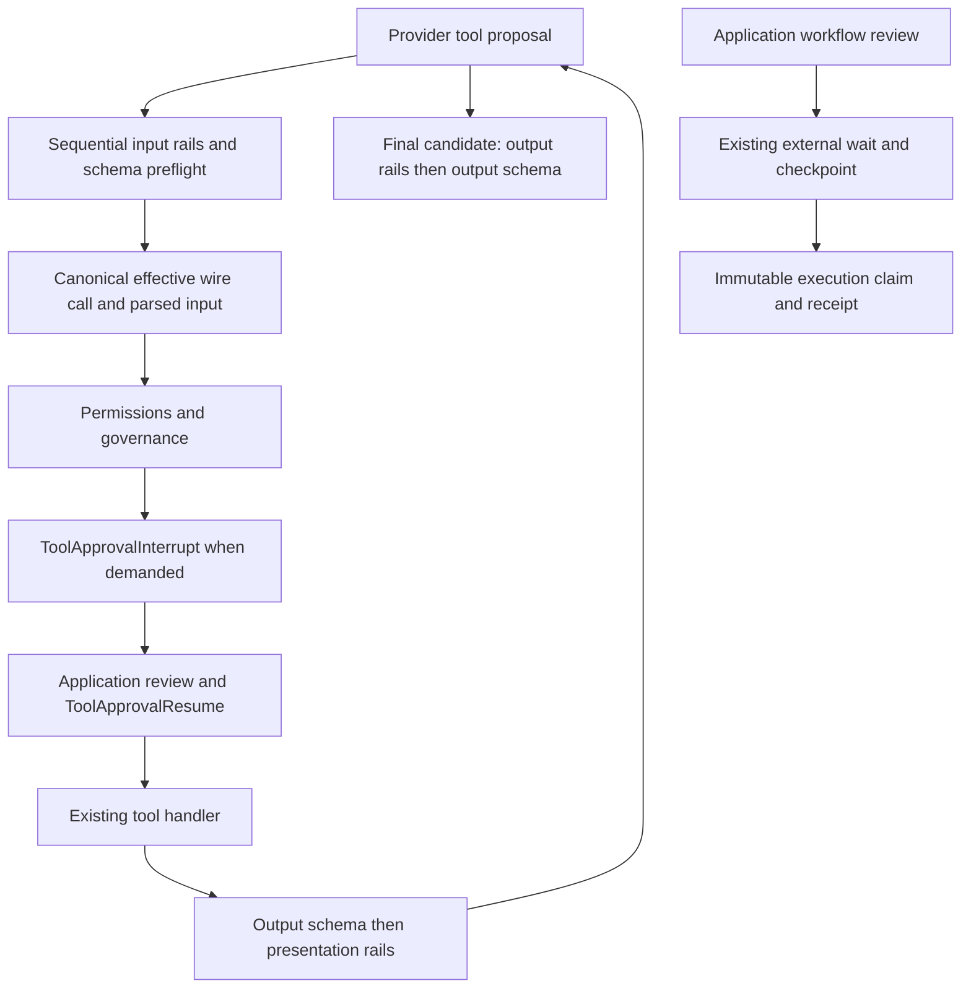

# Decision boundary architecture

Content guardrails inspect or transform content; permissions and governance authorize an effective tool occurrence; tool approval checkpoints a prepared batch and resumes it with authenticated application decisions; workflow review uses external waits and application-owned execution admission. An allow is local to its boundary and cannot override another boundary's deny. A transform cannot grant authority. No guardrail approval effect is added.

Shared core decisions owns validated evidence, identity and bounded callbacks, not policy DSL or persistence. Governance owns reduction, approval demands and audit. Session runtime owns approval checkpoints and resume validation. Private tool execution owns prepared batches and deadlines. Provider adapters own opaque continuation mapping. Addon retains rail compilation and actions. Review storage stays application-owned.

Concurrency: preflight all proposed calls before any side effect, then existing bounded execution. Cancellation fences late results but cannot undo noncooperative external effects. Review idempotency supplies domain certainty, not a callback timeout. No new distributed subsystem is introduced.
