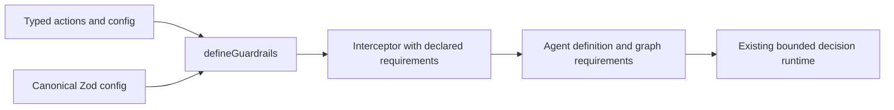

# Architecture

Core owns definition-closure validation, native tool inference, and
provider-neutral interceptor requirements. The addon owns the canonical Zod
configuration, actions/selectors and maps active actions into those
requirements. Applications own providers, detectors, schemas, named actions and
instance-before-serving. Website and skills consume the public behavior; they do
not own alternative contracts. No dependency points from core into the addon.

There are deliberately separate static, construction and invocation guarantees.
They reuse the same runtime compiler/validator and do not claim to prove
semantic inclusion between arbitrary Zod schemas. See the normative stage table
and actual phase values in the contracts.
